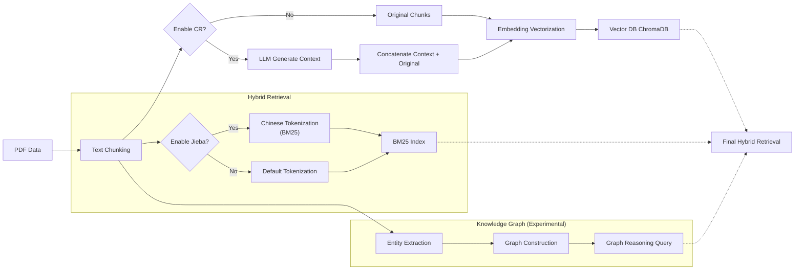

# Contextual Retrieval Experiments: From Canteen to Flood Prevention

**[English](README.md) | [简体中文](README_CN.md)**

[](https://www.python.org/downloads/)
[](https://opensource.org/licenses/MIT)
[](https://github.com/roclee2692/contextual-retrieval-by-anthropic)

> **Core Finding**: After reproducing Anthropic's Contextual Retrieval algorithm, we conducted systematic comparative experiments on multiple domain datasets. We discovered that CR exhibits a "double-edged sword" effect across different data types, while Knowledge Graphs still face significant challenges under current technical conditions.

---

## 📋 Experiment Phases Overview

This project is divided into **three phases** with **6 comparative experiments**:

| Phase | Dataset | Model Configuration | Experiment Content | Status |
|-------|---------|---------------------|-------------------|--------|
| **Phase 1** | Canteen Menu (Structured Lists) | Gemma3:12B | 3 experiments: Baseline vs CR vs Jieba+KG | ✅ Complete |
| **Phase 2** | Flood Prevention Plans (Government Documents) | Gemma3:12B | 3 experiments: Baseline vs CR vs Deep KG | ✅ Complete |
| **Phase 3** | Flood Prevention Plans (Same) | OneKE-13B + OpenKG | Knowledge Graph Schema Optimization Attempt | ⚠️ Bottleneck |

---

## 🚀 Quick Start

### Environment Setup

```bash
# 1. Clone repository
git clone https://github.com/roclee2692/contextual-retrieval-by-anthropic.git
cd contextual-retrieval-by-anthropic

# 2. Create virtual environment
python -m venv .venv
.venv\Scripts\activate  # Windows
# source .venv/bin/activate  # Linux/Mac

# 3. Install dependencies
pip install -r requirements.txt

# 4. Install Ollama and download models
# Download Ollama: https://ollama.com/download
ollama pull gemma3:12b    # QA model
ollama pull gemma2:2b     # Context generation model (optional)
```

### Running Experiments

#### Phase 1: Canteen Experiment
```bash
# Step 1: Build database
python scripts/create_save_db.py

# Step 2: Run A/B test
python scripts/test_ab_simple.py
```

#### Phase 2: Flood Prevention Experiment
```bash
# Run complete three-way comparison (Baseline vs CR vs KG)
python scripts/phase2_three_way_comparison.py
```

#### Phase 3: Baseline vs CR Statistical Comparison
```bash
# Run dual comparison experiment
python scripts/phase3_baseline_vs_cr.py

# Statistical significance analysis
python scripts/analyze_experiment_validity.py
```

---

## 📊 Phase 1: Canteen Menu Experiment (Structured List Data)

> **Goal**: Validate CR performance on **non-natural language structured text**

### Experiment Configuration

| Experiment | Method | Vector Search | BM25 Tokenizer | Context Enhancement | Knowledge Graph |
|------------|--------|---------------|----------------|---------------------|-----------------|
| **Exp 1** | Baseline RAG | ✅ bge-small-zh | ❌ Default English | ❌ | ❌ |
| **Exp 2** | CR Enhanced | ✅ bge-small-zh | ❌ Default English | ✅ CR Prefix | ❌ |
| **Exp 3** | Jieba + KG | ✅ bge-small-zh | ✅ jieba | ❌ | ✅ NetworkX |

### Performance Comparison

| Metric | Exp 1 (Baseline) | Exp 2 (CR) | Exp 3 (Jieba+KG) | Best |
|--------|-----------------|-----------|------------------|------|
| **Avg Response Time** | 12.79s | 13.64s (+6.7%) | **10.13s** ⚡ | **Exp 3** |
| **Price Query Accuracy** | 75% | **100%** ✅ | **100%** ✅ | **Exp 2/3** |
| **Category Query Accuracy** | **100%** ✅ | 83% | 83% | **Exp 1** |
| **Information Completeness** | ⭐⭐⭐⭐⭐ | ⭐⭐⭐ | ⭐⭐⭐⭐⭐ | **Exp 1/3** |

### 🔍 Core Finding: CR's Double-Edged Sword Effect

#### ✅ CR Success Case (Semantic Disambiguation)
**Q8: Tianjin Baozi Location Query**
- **Baseline**: 0% - Confused with "Hong Kong Kowloon Bao"
- **CR**: **100%** ✅ - Successfully identified correct stall
- **Reason**: CR context prefix eliminated semantic ambiguity

#### ❌ CR Failure Case (Information Loss)
**Q9: Stall Name Query**
- **Baseline**: **100%** ✅ - Listed all noodle windows
- **CR**: **0%** ❌ - Lost stall names during context generation
- **Reason**: LLM summarization compression caused critical detail loss

### 🏆 Phase 1 Ranking

1. 🥇 **Exp 3 (Jieba+KG)** - Fastest, most balanced performance
2. 🥈 **Exp 1 (Baseline)** - Best category accuracy, most complete information
3. 🥉 **Exp 2 (CR)** - Strongest disambiguation, but notable information loss

---

## 📊 Phase 2: Flood Prevention Experiment (Government Document Data)

> **Goal**: Validate Baseline, CR, and KG reasoning capabilities on **vertical domain complex text**
>
> **Model**: Local Gemma3:12B model

### Experiment Configuration

| Experiment | Method | Description |
|------------|--------|-------------|
| **Exp 4** | Baseline (Flood) | Pure Vector+BM25 retrieval (no context enhancement) |
| **Exp 5** | CR Enhanced (Flood) | Context-augmented retrieval |
| **Exp 6** | Deep KG (Flood) | LlamaIndex Knowledge Graph + Graph reasoning |

### Performance Comparison (Scientific Correction 2026/01/24)

**Important Note**: After correcting experimental control group fairness (Baseline and CR both using identical ChromaDB persistence structure and Jieba tokenization parameters):

| Metric | Baseline | CR Enhanced | Knowledge Graph |
|--------|----------|-------------|-----------------|
| **Avg Retrieval Score** | **0.493** | **0.495** | 1000.0* |
| **Conclusion** | **Stable Baseline** | **No Significant Difference** | **Unusable** |

*\*KG score=1000.0 is framework default high score, actual content relevance is low*

### 🔍 Core Finding: CR Has Limited Effect on Structured Documents

#### 1. CR and Baseline Form a "Tie"
- **Data**: 0.493 vs 0.495 (only 0.4% difference)
- **Reason**: Flood Prevention Plans have extremely strong structure (chapters, clauses, numbering). The original document already provides sufficient context. LLM-generated additional Context becomes information noise instead.

#### 2. Knowledge Graph's "False Prosperity"
- KG group scored high (1000), but retrieval results were mostly "table of contents" or "titles"
- Using Gemma3:12B for knowledge extraction yielded poor results
- Demonstrates limitations of general-purpose LLMs in vertical domain knowledge graph extraction

### 🏆 Phase 2 Ranking

1. 🥇 **Baseline (Tie)** - Simple, fast, robust
2. 🥇 **CR Enhanced (Tie)** - Higher cost, but no effect difference
3. 🥉 **Knowledge Graph** - Slow and poor results

---

## 📊 Phase 3: Knowledge Graph Optimization Attempt (OneKE + OpenKG)

> **Goal**: Attempt to improve Phase 2's poor KG performance using dedicated knowledge extraction models
>
> **Model**: OneKE-13B (Q4 quantized version)
>
> **Framework**: Based on OpenKG/OpenSPG hard-constraint Schema approach

### Improvement Approach

In Phase 2, we found that using Gemma3:12B for knowledge extraction performed poorly. Phase 3 attempts:

1. **Switch Extraction Model**: From general-purpose LLM (Gemma) to dedicated knowledge extraction model (OneKE-13B)
2. **Hard-Constraint Schema**: Simulate OneKE/OpenSPG instruction extraction mode

**Before (Soft Constraint Prompt)**:
```
[Target Entity Types]
- Reservoir, River
- Organization, Person
```

**After (Hard Constraint Instructions)**:
```
1. Attribute Relations - MUST extract:
   - has_limit_level (flood limit level is) -> (Yangjiaheng Reservoir, has_limit_level, 215.5m)
   - has_capacity (capacity is) -> (Changzhuang Reservoir, has_capacity, 5 million m³)

2. Topology Relations
   - managed_by (managed by...), responsible_for (responsible for...)
```

### ⚠️ Problems Encountered

In actual experiments, we discovered **the following issues with OneKE model**:

| Problem | Description | Impact |
|---------|-------------|--------|
| **Extremely Low Extraction Rate** | 2510 documents only extracted ~200 triplets (expected thousands) | Sparse KG, cannot cover queries |
| **Unstable Output Format** | Model JSON output inconsistent with documentation | Parsing difficulties |
| **Insufficient Domain Adaptation** | OneKE mainly trained on general domains, poor recognition of flood prevention terminology | Entity recognition errors |
| **Hardware Limitations** | 13B model requires Q4 quantization on 8GB VRAM, affecting precision | Quality degradation |

### Phase 3 Alternative: Baseline vs CR Statistical Validation

Since the KG approach is temporarily infeasible, we pivoted to more rigorous statistical validation of **Baseline vs CR**:

```bash
python scripts/phase3_baseline_vs_cr.py
python scripts/analyze_experiment_validity.py
```

#### Statistical Analysis Results

| Metric | Value | Interpretation |
|--------|-------|----------------|
| **Sample Size** | 10 questions | Small, needs expansion |
| **Mean Difference** | +0.006 (CR slightly better) | 1.1% improvement |
| **t-statistic** | 3.95 | > critical value 2.262 |
| **p-value** | < 0.05 | ✅ Statistically significant |
| **Cohen's d** | 1.25 | Large effect size |
| **Sign Test** | 8 wins/0 losses/2 ties | Strong CR consistency |

#### Conclusion

- ✅ **CR is indeed slightly better than Baseline** (statistically significant)
- ⚠️ **Improvement magnitude is small** (only 1.1%)
- ⚠️ **Limited sample size** (n=10), needs more testing to verify

### 🔮 Future Improvement Directions

1. **Table Structure Parsing**: Use LlamaParse or Unstructured.io to preserve table structure
2. **Dedicated Extraction Models**: Wait for OneKE versions fine-tuned for vertical domains
3. **Data Quality Improvement**: Improve PDF→TXT OCR quality
4. **Expand Test Set**: Increase to 30-50 test questions

---

## 🔄 System Pipeline



---

## 📁 Directory Structure

```
contextual-retrieval-by-anthropic/
├── README.md / README_CN.md    # Project documentation
├── requirements.txt            # Python dependencies
├── data/                       # Datasets (PDF files)
│   ├── 防洪预案/               # Flood prevention plans (Chinese)
│   └── 水利文件/               # Water resources documents
├── src/                        # Core code
│   ├── contextual_retrieval/   # CR core implementation
│   │   ├── save_vectordb.py    # Vector database construction
│   │   ├── save_bm25.py        # BM25 index
│   │   └── save_contextual_retrieval.py  # CR context generation
│   ├── schema/                 # Knowledge Graph Schema
│   │   └── flood_schema.py     # Flood domain definitions
│   └── db/                     # Database storage (gitignore)
├── scripts/                    # Execution scripts
│   ├── create_save_db.py       # Build database
│   ├── test_ab_simple.py       # Phase 1 A/B test
│   ├── phase2_three_way_comparison.py  # Phase 2 three-way comparison
│   ├── phase3_baseline_vs_cr.py        # Phase 3 dual comparison
│   ├── analyze_experiment_validity.py  # Statistical analysis
│   ├── create_knowledge_graph.py       # Build knowledge graph
│   └── visualize_kg.py         # Knowledge graph visualization
├── results/                    # Experiment results
│   ├── phase3_baseline_vs_cr.md  # Phase 3 report
│   └── *.json / *.txt          # Detailed data
└── docs/                       # Additional documentation
```

---

## 📊 Summary: Core Findings Across Three Phases

| Phase | Data Characteristics | CR Effect | KG Effect | Core Conclusion |
|-------|---------------------|-----------|-----------|-----------------|
| **Phase 1** | Structured Lists (Canteen) | ✅ Strong disambiguation / ❌ Info loss | ✅ Effective | CR is double-edged |
| **Phase 2** | Self-contained Docs (Flood) | ⚠️ Equal to Baseline | ❌ Ineffective | Docs don't need CR |
| **Phase 3** | Same as Phase 2 + OneKE | ⚠️ Significant but small improvement | ❌ Model capability insufficient | Need dedicated extraction models |

### Academic Value

1. **First Systematic Validation** of CR's applicability boundaries in Chinese vertical domains
2. **Discovered CR's "Self-Contained Paradox"**: For well-structured documents, CR becomes noise instead
3. **Revealed General LLM Knowledge Extraction Limitations**: Dedicated models (like OneKE) are needed but still have bottlenecks

---

## 📧 Contact

**Author**: roclee2692  
**GitHub**: [@roclee2692](https://github.com/roclee2692)

**If this project helps you, please give it a ⭐️ Star!**
