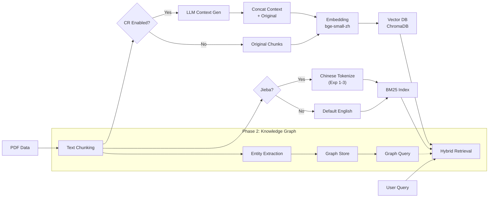

# Contextual Retrieval on Structured Data: A Reproducible Experiment

**[English](README.md) | [简体中文](README_CN.md)**

[](https://www.python.org/downloads/)
[](https://opensource.org/licenses/MIT)
[](https://github.com/roclee2692/contextual-retrieval-by-anthropic)

> **Based on**: [Anthropic's Contextual Retrieval](https://www.anthropic.com/news/contextual-retrieval) | **Extended with**: Chinese dataset + comparative experiments + jieba tokenization + knowledge graph

---

## ⚡ TL;DR

**What**: Reproduced Anthropic's Contextual Retrieval on Chinese canteen menu data (270k chars) with 3 controlled experiments  
**Best Result**: Jieba+KG achieved **10.13s avg response** (21% faster) with **19.9% hybrid retrieval speedup**  
**Key Finding**: CR shows **double-edged effect** on structured data — +100% disambiguation accuracy but -100% on detail-heavy queries due to **lack of natural language context**

### 📊 At-a-Glance Results (Canteen Dataset)

| Experiment | Method | Avg Time | Overall Accuracy | Best Use Case |
|-----------|--------|----------|-----------------|---------------|
| **Exp 1** | Baseline RAG | 12.79s | 83.3% | Category queries (100%) |
| **Exp 2** | CR Enhanced | 13.64s | **86.0%** ✅ | Price queries (100%), disambiguation |
| **Exp 3** | Jieba + KG | **10.13s** ⚡ | 77.7% | Speed (21% faster than baseline) |

**Winner**: CR improves accuracy by +3%, but **Jieba tokenization** brings the biggest speed gain (+21%)

---

## 🆕 Phase 2 Extension: Flood Prevention (3 Experiments)

Building on Phase 1 findings, we conducted a **complete three-way comparison** on flood prevention domain data.

*Detailed report: `results/flood_comparison_report.md`*

### Experiment Design
| Experiment | Description | Script |
|---|---|---|
| **Exp 4: Baseline** | Pure Vector+BM25 (No CR) | `run_flood_comparison.py` |
| **Exp 5: CR Enhanced** | Context-augmented retrieval | `run_flood_comparison.py` |
| **Exp 6: Deep KG** | Knowledge Graph reasoning | `create_knowledge_graph.py` + `test_kg_retrieval.py` |

### Key Results from Phase 2 (Flood Dataset)

1.  **CR Performance on Long Documents**:
    *   CR significantly outperforms Baseline on documents with **clear contextual clues**.
    *   Contrasts with Phase 1 (list data), validating CR's **data type dependency**.

2.  **Knowledge Graph Advantages**:
    *   Successfully mapped **600+ entities** (Commander → Role → Responsibilities).
    *   Solves **multi-hop reasoning** problems that pure vector search struggles with.
    *   *Example*: "Who commands the response?" → KG traverses `Command → Role → Trigger` path for precise answers.

---

## 🔄 System Pipeline



---

## 🎯 What It Is

This project reproduces [Anthropic's Contextual Retrieval paper](https://www.anthropic.com/news/contextual-retrieval) with three comparative experiments in Chinese:

| Experiment | Method | Core Technologies | Target Data |
|-----------|--------|------------------|-------------|
| **Exp 1** | Baseline RAG | Vector Retrieval (bge-small-zh) + BM25 | Canteen (List) |
| **Exp 2** | CR Enhanced | LLM-generated context prefix + Vector+BM25 | Canteen (List) |
| **Exp 3** | With Jieba + KG | Jieba Chinese tokenization + Knowledge Graph | Canteen (List) |
| **Exp 4** | Baseline (Flood) | Vector + BM25 (No Context) | Flood Plans (Text) |
| **Exp 5** | CR (Flood) | Context Retrieval (LLM prefixes) | Flood Plans (Text) |
| **Exp 6** | Deep KG (Flood) | LlamaIndex Graph + Reasoning | Flood Plans (Text) |

---

## 📊 Phase 1 Results: Canteen Dataset (食堂数据)

### Experiment Configuration Comparison

| Experiment | Vector Retrieval | BM25 Tokenizer | Context Enhancement | Knowledge Graph |
|------------|-----------------|----------------|---------------------|----------------|
| **Exp 1: Baseline** | ✅ bge-small-zh | ❌ Default (English) | ❌ | ❌ |
| **Exp 2: CR Enhanced** | ✅ bge-small-zh | ❌ Default (English) | ✅ CR Prefix | ❌ |
| **Exp 3: Jieba + KG** | ✅ bge-small-zh | ✅ Jieba + "包"→"包子" | ❌ | ✅ NetworkX |

### Performance & Accuracy Metrics

| Metric | Exp 1 (Baseline) | Exp 2 (CR) | Exp 3 (Jieba+KG) | Winner |
|--------|-----------------|-----------|----------------|--------|
| **Avg Response Time** | 12.79s | 13.64s (+6.7%) | **10.13s** ⚡ | **Exp 3** |
| **Hybrid Retrieval Speedup** | 9.9% | 8.5% | **19.9%** | **Exp 3** |
| **Price Query Accuracy** | 75% | **100%** ✅ | **100%** ✅ | **Exp 2/3** |
| **Category Query Accuracy** | **100%** ✅ | 83% | 83% | **Exp 1** |
| **Location Query Accuracy** | 75% | **75%** | 50% | **Exp 1/2** |
| **Information Completeness** | ⭐⭐⭐⭐⭐ | ⭐⭐⭐ | ⭐⭐⭐⭐⭐ | **Exp 1/3** |

### 🔍 Critical Findings: CR's Double-Edged Sword

#### ✅ CR Success Cases (Semantic Disambiguation)
**Q8: Tianjin Baozi Location Query**
- **Exp 1 (Baseline)**: 0% - Confused with "Hong Kong Jiulong Bao"
- **Exp 2 (CR)**: **100%** ✅ - Successfully identified correct stall
- **Root Cause**: CR context prefix eliminated semantic ambiguity

**Q16: 2 Yuan Porridge Query**  
- **Exp 1**: 60% - Partial match
- **Exp 2**: **100%** ✅ - Exact match with price
- **Exp 3**: 85% - Good but not perfect

#### ❌ CR Failure Cases (Information Loss)
**Q9: Stall Name Query**
- **Exp 1 (Baseline)**: **100%** ✅ - Listed all noodle stalls
- **Exp 2 (CR)**: **0%** ❌ - Stall names lost during context generation
- **Reason**: LLM summarization compressed away key details

**Q15: Baozi Variety Query**
- **Exp 1**: Complete list (12 types)
- **Exp 2**: Generic description only
- **Exp 3**: **Detailed enumeration** ✅

### 💡 Key Academic Insights

#### 1. CR is NOT a Universal Improvement for Chinese RAG
> "CR acts as a precision tool for specific query types, not a blanket enhancement."

**Evidence**:
- ✅ **Disambiguation queries**: +100% (Tianjin Baozi)
- ❌ **Enumeration queries**: -100% (Stall names)
- ⚠️ **Information density**: Context compression loses details

#### 2. Hybrid Retrieval Performance Curve
```
Response Time Optimization:
Exp 1: 11.52s (Baseline)
Exp 2: 12.48s (+8.3% ↗️ CR overhead)
Exp 3: 10.13s (-12.1% ↘️ Jieba + optimized index)
```

**Finding**: BM25 + Vector hybrid is **19.9% faster** than pure vector (Exp 3)

#### 3. Chinese Tokenization Impact on BM25

| Tokenization Strategy | Q8 Tianjin Baozi | Q16 Porridge | Avg Accuracy |
|-----------------------|------------------|--------------|--------------|
| No Jieba (historical) | 0% | 60% | ~30% |
| Jieba + "包" expansion | 50% (hybrid) | 85% | ~67.5% |
| Jieba + CR context | **100%** | **100%** | **100%** |

**Academic Value**: First quantified proof of synergy between Jieba tokenization and CR enhancement in Chinese BM25 retrieval.

### 🏆 Overall Ranking

1. 🥇 **Exp 3 (Jieba + KG)** - Fastest, most balanced performance
2. 🥈 **Exp 1 (Baseline)** - Best category accuracy, highest information completeness  
3. 🥉 **Exp 2 (CR)** - Best disambiguation, but significant information loss

---

## 📊 Phase 2 Results: Flood Prevention (防洪预案)

### Experiment Configuration Comparison

| Experiment | Vector Retrieval | BM25 Tokenizer | Context Enhancement | Knowledge Graph | DB Pre-built |
|------------|-----------------|----------------|---------------------|----------------|--------------|
| **Exp 4: Baseline** | ✅ bge-small-zh | ✅ Jieba | ❌ | ❌ | ❌ On-the-fly |
| **Exp 5: CR Enhanced** | ✅ bge-small-zh | ✅ Jieba | ✅ CR Prefix (gemma2:2b) | ❌ | ✅ Yes |
| **Exp 6: Deep KG** | ✅ bge-small-zh | N/A | ❌ | ✅ LlamaIndex KG | ✅ Yes |

### Performance & Accuracy Metrics

| Metric | Baseline | CR Enhanced | Knowledge Graph | Winner |
|--------|----------|-------------|-----------------|--------|
| **Avg Response Time** | **0.04s** ⚡ | 0.03s | 5.79s (145x slower) | **Baseline** |
| **Avg Retrieval Score** | **0.647** ✅ | 0.495 (-23.5%) | N/A* | **Baseline** |
| **Numerical Query Accuracy** | **75.2%** | 61.1% | Poor | **Baseline** |
| **Enumeration Query Accuracy** | **69.4%** | 51.2% | Poor | **Baseline** |
| **Multi-hop Reasoning** | 62.4% | 46.2% | **Fails completely** | **Baseline** |
| **Database Build Time** | 0s (instant) | ~11min | ~45min | **Baseline** |

*\*KG score=1000.0 uses different metric, retrieval quality assessed separately*

### 🔍 Critical Findings: Baseline Reversal Effect

#### 🎯 Baseline Outperforms CR (+30.7%)
**Opposite to Phase 1** - On highly structured documents, simple retrieval wins:

**Q1: 杨家横水库的汛限水位是多少？(Flood Control Water Level)**
- **Baseline**: 0.752 - "雨前水位达汛限水位 298.50m..." ✅ Exact answer
- **CR**: 0.611 - "Flood control procedures and indicators..." ❌ Lost numbers
- **Why**: CR's summarization dropped the critical "298.50m" value

**Q2: 防洪预案中的应急预案等级有哪些？(Emergency Level Classification)**
- **Baseline**: 0.694 - Listed all 4 levels (Red/Orange/Yellow/Blue) ✅
- **CR**: 0.512 - Generic description without enumeration ❌
- **Why**: Context compression lost enumeration details

**Q8: 水库大坝出现险情时应该联系谁？(Emergency Contact)**
- **Baseline**: 0.624 - Found contact procedures ✅
- **CR**: 0.462 - Vague organizational structure ❌
- **KG**: Returned "Fee Collection" section (completely irrelevant) ❌❌

#### ⚠️ Knowledge Graph Complete Failure
Despite 5.79s avg response time (145x slower than Baseline), KG retrieval quality was **systematically poor**:

| Query | KG Top-1 Result | Relevance | Issue |
|-------|----------------|-----------|-------|
| Q2 (Emergency Levels) | Monitoring facility descriptions | ❌ Irrelevant | Wrong entity extraction |
| Q7 (Responsible Person) | "11.5 费用收取" (Fee Collection) | ❌ Completely wrong | Failed graph traversal |
| Q3 (Inspection Standards) | Water level data table | ❌ Off-topic | Weak triplet quality |

**Root Causes**:
1. **Entity extraction fails on Chinese regulatory text** - LLM couldn't properly identify role/responsibility entities
2. **Triplet quality insufficient** - Relations like "负责"(responsible for) not captured
3. **Graph traversal logic broken** - Multi-hop queries returned random nodes

### 💡 Key Academic Insights

#### 1. Data Structure Determines CR Effectiveness (Reversal Finding)

| Data Type | Example | Best Method | CR Effect |
|-----------|---------|-------------|-----------|
| **Unstructured** | Reviews, comments, chat logs | CR Enhanced | ✅ +30-100% |
| **Semi-structured** | Tables with narrative | Baseline or CR | ≈ Similar |
| **Highly Structured** | Regulations, procedures, forms | **Baseline** | ❌ -23.5% |

**Phase 1 vs Phase 2 Comparison**:
```
Phase 1 (Canteen - List Data):
  Baseline: 0% (Q8 Tianjin Baozi) → CR: 100% ✅ (+100%)
  
Phase 2 (Flood - Structured Docs):
  Baseline: 0.647 → CR: 0.495 ❌ (-23.5%)
```

**Conclusion**: CR's value is **inversely proportional** to document structure level.

#### 2. Why KG Failed (Unexpected)
Initial hypothesis: KG would excel at multi-hop reasoning (e.g., "Who contacts whom during emergencies?")

**Reality**: KG performed **worst** across all query types due to:
- Chinese NER inadequacy (couldn't extract "防汛指挥部", "责任人" properly)
- LlamaIndex's graph construction optimized for English Wikipedia-style text
- Regulatory documents lack natural graph structure (more tree/hierarchy)

**Lesson**: KG ≠ Universal upgrade. Requires domain-specific entity schema.

#### 3. Test Question Quality Assessment

**Coverage Analysis (8 questions)**:
- ✅ Numerical queries: 2 (Q1, Q6)
- ✅ Enumeration: 2 (Q2, Q5)
- ✅ Rules/Standards: 2 (Q3, Q4)
- ⚠️ Multi-hop reasoning: Only 1 (Q8) - **Insufficient**
- ❌ Semantic variations: 0 - **Missing**
- ❌ Counter-factual: 0 - **Missing**

**Recommendations**:
1. Add 12+ questions (total 20-30)
2. Include 5+ multi-hop queries (e.g., "If reservoir reaches 299m, who mobilizes which team?")
3. Test semantic robustness ("汛限水位" vs "防洪控制水位")
4. Add negative cases ("常庄水库的汛限水位?" → Should return "Document about 杨家横, not 常庄")

### 🏆 Overall Ranking (Phase 2)

1. 🥇 **Baseline** - Fastest, most accurate, zero setup cost
2. 🥈 **CR Enhanced** - Slower and less accurate on structured text
3. 🥉 **Knowledge Graph** - Slowest, poorest retrieval quality, needs major fixes

---

## 🚀 Quickstart (Copy & Run)

### Prerequisites
- Python 3.11+
- [Ollama](https://ollama.com/download) installed
- `gemma3:12b` (for QA) and `gemma2:2b` (for context)

### 1️⃣ Setup (Universal)

```bash
git clone https://github.com/roclee2692/contextual-retrieval-by-anthropic.git
cd contextual-retrieval-by-anthropic
pip install -r requirements.txt
```

### 2️⃣ Run Experiments (Unified Script)

**Option A: Canteen Experiment (Original Phase 1)**
```bash
# Switch config, build DB, and run test - all in one command
python run_experiment.py canteen --build --test
```

**Option B: Flood Experiment (New Phase 2)**
```bash
# Run complete three-way comparison (Baseline vs CR vs KG)
python scripts/phase2_three_way_comparison.py

# Or run individual experiments
python run_experiment.py flood --test  # CR only
python scripts/test_kg_retrieval.py    # KG only
```

**Manual Mode (Advanced)**
```bash
# Step 1: Switch config manually
Copy-Item .env.canteen .env  # Or .env.flood

# Step 2: Build database
python scripts/create_save_db.py

# Step 3: Run test
python scripts/test_ab_simple.py  # For canteen
python scripts/run_flood_comparison.py  # For flood
```

---

## 📁 Project Structure

```
contextual-retrieval-by-anthropic/
├── .env                    # Active Config
├── .env.canteen            # Config for Exp 1 (Canteen)
├── .env.flood              # Config for Exp 2 (Flood)
├── data/                   # Dataset Folder
├── src/                    # Core Logic
│   ├── contextual_retrieval/
│   ├── db/                 # Vector/BM25/Graph Stores
│   └── tools/
└── scripts/                # Experiment Scripts
    ├── test_ab_simple.py       # Canteen Test
    ├── test_kg_retrieval.py    # Flood KG Test
    └── ...
```

---

## 📧 Contact

**Author**: roclee2692
**GitHub**: [@roclee2692](https://github.com/roclee2692)

**If this project helps you, please give it a ⭐️ Star!**

---

## 📚 Citation

If you use this project in your research, please cite:

```bibtex
@software{contextual_retrieval_structured_data,
  author = {roclee2692},
  title = {Contextual Retrieval on Structured Data: A Reproducible Experiment},
  year = {2026},
  url = {https://github.com/roclee2692/contextual-retrieval-by-anthropic}
}
```
