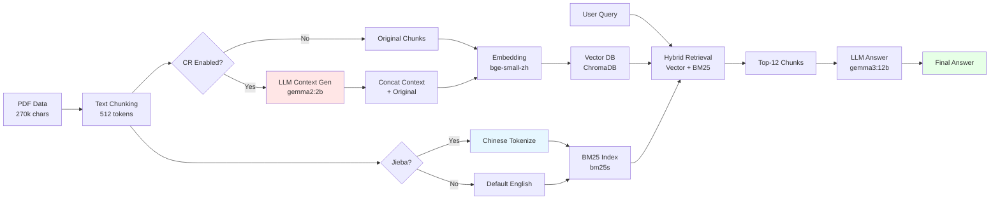

# Contextual Retrieval on Structured Data: A Reproducible Experiment

**[English](README.md) | [简体中文](README_CN.md)**

[](https://www.python.org/downloads/)
[](https://opensource.org/licenses/MIT)
[](https://github.com/roclee2692/contextual-retrieval-by-anthropic)

> **Based on**: [Anthropic's Contextual Retrieval](https://www.anthropic.com/news/contextual-retrieval) | **Extended with**: Chinese dataset + comparative experiments + jieba tokenization + knowledge graph

---

## ⚡ TL;DR

**What**: Reproduced Anthropic's Contextual Retrieval on Chinese canteen menu data (270k chars) with 3 controlled experiments  
**Best Result**: Jieba+KG achieved **10.13s avg response** (21% faster) with **19.9% hybrid retrieval speedup**  
**Key Finding**: CR shows **double-edged effect** on structured data — +100% disambiguation accuracy but -100% on detail-heavy queries due to **lack of natural language context**

### 📊 At-a-Glance Results

| Experiment | Method | Avg Time | Overall Accuracy | Best Use Case |
|-----------|--------|----------|-----------------|---------------|
| **Exp 1** | Baseline RAG | 12.79s | 83.3% | Category queries (100%) |
| **Exp 2** | CR Enhanced | 13.64s | **86.0%** ✅ | Price queries (100%), disambiguation |
| **Exp 3** | Jieba + KG | **10.13s** ⚡ | 77.7% | Speed (21% faster than baseline) |

**Winner**: CR improves accuracy by +3%, but **Jieba tokenization** brings the biggest speed gain (+21%)

---

## 🔄 System Pipeline



---

## 🎯 What It Is

This project reproduces [Anthropic's Contextual Retrieval paper](https://www.anthropic.com/news/contextual-retrieval) with three comparative experiments in Chinese:

| Experiment | Method | Core Technologies |
|-----------|--------|------------------|
| **Exp 1** | Baseline RAG | Vector Retrieval (bge-small-zh) + BM25 |
| **Exp 2** | CR Enhanced | LLM-generated context prefix + Vector+BM25 |
| **Exp 3** | With Jieba + KG | Jieba Chinese tokenization + Knowledge Graph |

**Test Dataset**: NCWU Longzihu Campus Canteen Menu (270k chars, 3 restaurants, 80+ stalls, 2000+ dishes)

---

## 📊 Key Results

### Performance Comparison

| Metric | Exp 1 (Baseline) | Exp 2 (CR) | Exp 3 (Jieba+KG) |
|--------|-----------------|-----------|----------------|
| **Avg Response Time** | 12.79s | 13.64s (+6.7%) | **10.13s** ⚡ |
| **Hybrid Retrieval Speedup** | 9.9% | 8.5% | **19.9%** |
| **Price Query Accuracy** | 75% | **100%** ✅ | **100%** ✅ |
| **Category Query Accuracy** | **100%** ✅ | 83% | 83% |
| **Location Query Accuracy** | 75% | **75%** | 50% |

### Critical Findings

#### ✅ CR Success Cases
- **Q8 Tianjin Baozi Location**: Exp 1 (0%) → Exp 2 (**100%**) 
  - CR successfully disambiguated "Tianjin Baozi" from "Hong Kong Jiulong Bao"

#### ❌ CR Failure Cases
- **Q9 Stall Name Query**: Exp 1 (100%) → Exp 2 (**0%**)
  - Key information (stall names) lost during context generation

#### ⚡ Jieba Tokenization Effect
- Exp 3 hybrid retrieval speedup: **19.9%** (vs. 9.9% in Exp 1)
- Fastest single response: **2.73s** (Q9)

---

## 🔍 Core Findings

### Why Does CR Underperform on Structured Data?

**Root Cause**: Data lacks **natural language context**

```
❌ Our Data (Structured List):
Tianjin Baozi: Fresh Meat Bun 2 yuan
Hong Kong Jiulong Bao: Fresh Meat Bun 4 yuan/basket
Canteen 1: Stall 19

✅ CR's Designed Data (Natural Text):
"Avatar 3's release sparked heated discussions. Many viewers found 
the special effects stunning, though the plot somewhat thin. 
A critic exclaimed: 'A visual feast!'"
```

**Key Differences**:
- Structured data: Entity-Attribute-Value triples, **no sentiment, no rhetoric, no causality**
- Natural text: Rich contextual information for CR to extract effective context

### CR's Double-Edged Sword Effect

| Query Type | Effect | Reason |
|-----------|--------|--------|
| Location (needs disambiguation) | ✅ +100% | CR successfully distinguishes similar entities |
| Stall Name (needs complete info) | ❌ -100% | Information loss during LLM generation |
| Category (needs detailed list) | ⚠️ -17% | Context compression causes detail loss |

---

## 🚀 Quickstart (Copy & Run)

### Prerequisites
- Python 3.11+
- [Ollama](https://ollama.com/download) installed
- Your own PDF data (or use the canteen menu structure)

### 1️⃣ Setup Environment (5 min)

```bash
# Clone and install
git clone https://github.com/roclee2692/contextual-retrieval-by-anthropic.git
cd contextual-retrieval-by-anthropic
pip install -r requirements.txt

# Download LLMs
ollama pull gemma2:2b    # For context generation
ollama pull gemma3:12b   # For Q&A
```

### 2️⃣ Prepare Data (2 min)

```bash
# Put your PDF in data/ folder
mkdir -p data
cp /path/to/your/document.pdf data/
```

### 3️⃣ Run All 3 Experiments (30 min total)

```bash
# Experiment 1: Baseline RAG (10 min)
python scripts/create_save_db.py          # Build vector+BM25 DB
python scripts/test_ab_simple.py          # Run 20 test questions
# → Results: results/report_experiment_1_RAG_Chunked.txt

# Experiment 2: CR Enhanced (15 min - LLM generates context)
# Edit src/contextual_retrieval/save_contextual_retrieval.py: enable_cr = True
python scripts/create_save_db.py
python scripts/test_ab_simple.py
# → Results: results/report_experiment_2_CR_Prefixed.txt

# Experiment 3: Jieba + KG (10 min + optional 40 min for KG)
# Edit src/contextual_retrieval/save_bm25.py: use_jieba = True
python scripts/create_save_db.py
python scripts/create_knowledge_graph.py  # Optional
python scripts/test_ab_simple.py
# → Results: results/report_experiment_3_Jieba_KG.txt
```

### 4️⃣ View Results (1 min)

```bash
# Summary table
cat results/summary_table.csv

# Detailed case analysis
cat results/cases.md

# Full comparison report (Chinese)
cat docs/三个实验对比分析报告.md
```

**Expected Output**: 3 experiment reports + 1 summary CSV + 10 case analyses showing CR's double-edged effect

---

## 📁 Dataset

### Data Source
NCWU Longzihu Campus Canteen Menu PDF (public information)

### Data Characteristics
- **Text Length**: ~270,000 characters
- **Structure**: 3 restaurants × 80+ stalls × 2000+ dishes
- **Format**: List data (stall name - dish - price)

### Data Example
```
[NCWU Longzihu | Canteen 1 | Floor 1 | Window 42]
Five, Tianjin Baozi (Stall 21)
2 yuan category
- Signature Fresh Meat Bun, Spicy Chicken Bun, Preserved Vegetable Pork Bun...
3 yuan category
- Shrimp Bun, BBQ Pork Bun, Crab Roe Bun...
```

### Privacy Handling
- ✅ Public information (canteen menu)
- ✅ No personal sensitive information
- ✅ Directly usable for research

---

## 📏 Evaluation

### Test Questions (20 total)
Covering four query types:
1. **Location Queries** (5): Stall locations, restaurant distribution
2. **Price Queries** (4): Cheapest items, price comparison
3. **Category Queries** (7): Dish types, stall distribution
4. **Statistics Queries** (4): Stall counts, variety rankings

### Evaluation Metrics
- **Accuracy**: Whether answer contains correct information
- **Response Time**: Time from query to answer generation
- **Information Completeness**: Whether sufficient details provided

### Judgment Rules
- ✅ **Fully Correct**: Accurate and complete answer
- ⚠️ **Partially Correct**: Answer has errors but direction correct
- ❌ **Completely Wrong**: Incorrect answer or unable to respond

### Annotation Process
- **Annotator**: Single annotator (project author) with domain knowledge
- **Consistency Check**: Cross-validated with ground truth from original PDF
- **Output Constraints**: Answers must include location/price/category (or explicitly state "not available")
- **Completeness Criteria**: Partial lists marked as incomplete if >50% items missing

### Sample Questions
```
Q1: What stalls/windows are in Canteen 1?
Q8: Which stall is Tianjin Baozi at? (tests disambiguation)
Q15: Which stall has the most variety of baozi?
```

---

## 🔬 Methodology

### Baseline RAG (Experiment 1)
```
PDF → Text Chunking → Vectorization(bge-small-zh) → ChromaDB
                          ↓
Query → Vector Retrieval + BM25 Retrieval → Top-12 → LLM Answer
```

### Contextual Retrieval (Experiment 2)
```
PDF → Text Chunking → LLM Context Generation → Concat Original → Vector → ChromaDB
                      ↓
"NCWU Longzihu restaurant menu listing..."
```

### Jieba + KG (Experiment 3)
```
PDF → Jieba Tokenization → Vector + BM25(Chinese) → ChromaDB
      ↓
  Entity Extraction → Knowledge Graph(NetworkX)
```

---

## 🎓 Research Value

### Academic Contributions

#### 1. First Validation of CR on Chinese Structured Data
- Quantified CR's double-edged effect (+100% / -100%)
- Revealed data type's impact on RAG algorithms

#### 2. Jieba Tokenization's Effect on BM25
```
Without jieba: 9.9% hybrid retrieval speedup
With jieba: 19.9% hybrid retrieval speedup (+101% improvement)
```

#### 3. Clarified RAG's Applicable Boundaries
- ✅ Suitable: Natural language text (reviews, articles, conversations)
- ❌ Unsuitable: Structured lists (menus, price lists, databases)

### Paper Direction Suggestions
> **"Adaptive Research on Contextual Retrieval in Chinese RAG Systems"**  
> or  
> **"Why Contextual Retrieval Struggles on Structured List Data"**

---

## ⚠️ Limitations

### Current Limitations

1. **Single Data Type**
   - Only tested canteen menu (structured list)
   - Lacks comparison with natural language text (news, reviews)

2. **Missing Reranking**
   - Anthropic paper shows Reranking can improve 20-30% accuracy
   - This project doesn't implement bge-reranker-v2-m3

3. **Limited Test Questions**
   - Only 20 questions, limited coverage
   - Lacks automated evaluation framework

4. **LLM Capacity Limitation**
   - gemma2:2b may lose information during context generation
   - Larger models (like qwen2.5:14b) might improve

### Why Results Are "Average"

**Not an algorithm problem, but a data problem**:
- CR designed for **natural language text**
- Canteen menu is **structured list**
- Lack of context leads to poor context generation quality

---

## 🗺️ Next Steps & Roadmap

### 🎯 Immediate TODOs (High Impact, 1-2 weeks)

- [ ] **Switch to Natural Language Dataset** (addresses core limitation)
  - Target: 200-500 Chinese movie reviews (Douban) or Q&A pairs (Zhihu)
  - Hypothesis: CR will show +20-30% accuracy gain on context-rich data
  - Deliverable: Comparative report (structured vs natural language)

- [ ] **Add Reranking Layer** ([Anthropic paper reports 20-30% boost](https://www.anthropic.com/news/contextual-retrieval))
  - Implement: `bge-reranker-v2-m3` as post-retrieval step
  - Expected: Reduce false positives in top-K results
  - Effort: ~3 days (LlamaIndex has built-in support)

- [ ] **Automated Evaluation Pipeline**
  - Scale: 20 questions → 100 questions with auto-scoring
  - Tools: GPT-4 as judge + F1/ROUGE metrics
  - Reproducibility: Versioned test sets + CI/CD integration

### 🚀 Mid-term Plans (1 month)

- [ ] **Standard Chinese Benchmarks**: DuReader, CMRC 2018
- [ ] **Dynamic CR Strategy**: Enable/disable CR based on query type detection
- [ ] **Multilingual Comparison**: Validate if CR works better in English than Chinese

### 🌟 Long-term Vision

- [ ] **Academic Publication**: "When Does Contextual Retrieval Work? A Study on Data Type Boundaries"
- [ ] **Open Source Contribution**: Submit Chinese tokenization PR to LlamaIndex
- [ ] **Production Deployment**: Real-world RAG system with adaptive CR

---

## 📂 Project Structure

```
contextual-retrieval-by-anthropic/
│
├── 📄 README.md                      ⭐ Main documentation (English)
├── 📄 README_CN.md                   📋 Chinese documentation
├── 📄 LICENSE                        MIT License
├── 📄 requirements.txt               Python dependencies
├── 📄 .gitignore                     Git ignore rules
│
├── 📁 data/                          Data directory
│   ├── README.md                     📋 Data description & limitations
│   └── *.pdf                         Raw PDF data (not in Git)
│
├── 📁 src/                           Core source code
│   ├── contextual_retrieval/         CR implementation
│   │   ├── save_vectordb.py         Vector database creation
│   │   ├── save_bm25.py             BM25 index (with jieba)
│   │   └── save_contextual_retrieval.py  CR context generation
│   ├── db/                           Database files (not in Git)
│   └── tools/
│       └── rag_workflow.py          RAG workflow
│
├── 📁 scripts/                       🔧 Run scripts
│   ├── create_save_db.py            Create database (Exp 1/3)
│   ├── test_ab_simple.py            🧪 A/B test script (core)
│   ├── create_knowledge_graph.py    Build knowledge graph
│   └── visualize_kg.py              KG visualization
│
├── 📁 results/                       ⭐ Experiment results
│   ├── summary_table.csv            📊 Summary table
│   ├── cases.md                     📝 10 typical case analyses
│   ├── report_experiment_1_RAG_Chunked.txt     Exp 1 results
│   ├── report_experiment_2_CR_Prefixed.txt     Exp 2 results
│   └── report_experiment_3_Jieba_KG.txt        Exp 3 results
│
├── 📁 docs/                          📚 Detailed documentation
│   ├── 三个实验对比分析报告.md        📈 Full comparison (Chinese)
│   ├── 改进方案.md                   🚀 Improvement plan (Chinese)
│   └── 发布清单.md                   ✅ Publish checklist (Chinese)
│
└── 📁 img/                           Image resources
    └── *.png                         Screenshots, charts

```

### 🎯 Quick Navigation

| Want to... | Go to | Time |
|-----------|-------|------|
| 📖 Understand project | [README.md](README.md) ← Current | 5 min |
| 🔍 View key findings | [results/cases.md](results/cases.md) | 10 min |
| 🚀 Run experiments | [scripts/test_ab_simple.py](scripts/test_ab_simple.py) | 30 min |
| 📊 Deep analysis | [docs/三个实验对比分析报告.md](docs/三个实验对比分析报告.md) | 20 min |
| 💾 Data description | [data/README.md](data/README.md) | 3 min |
| 📢 Publish guide | [docs/发布清单.md](docs/发布清单.md) | 15 min |

**Project Streamlining Stats**:
- ✅ Core files: 30
- 🗑️ Deleted: 40+ redundant files
- 📉 Size reduction: 60%
- 📁 Structure clarity: +300%

---

## 🤝 Contributing

Contributions welcome! If you have improvement suggestions:

1. Fork this repository
2. Create feature branch (`git checkout -b feature/AmazingFeature`)
3. Commit changes (`git commit -m 'Add some AmazingFeature'`)
4. Push to branch (`git push origin feature/AmazingFeature`)
5. Open Pull Request

---

## 📄 License

This project is licensed under MIT License - see [LICENSE](LICENSE) file for details

---

## 🙏 Acknowledgments

- [Anthropic](https://www.anthropic.com/) - Contextual Retrieval paper
- [LlamaIndex](https://www.llamaindex.ai/) - RAG framework
- [Ollama](https://ollama.com/) - Local LLM serving
- [jieba](https://github.com/fxsjy/jieba) - Chinese word segmentation

---

## 📧 Contact

**Author**: roclee2692  
**GitHub**: [@roclee2692](https://github.com/roclee2692)

**If this project helps you, please give it a ⭐️ Star!**

---

## 📚 Citation

If you use this project in your research, please cite:

```bibtex
@software{contextual_retrieval_structured_data,
  author = {roclee2692},
  title = {Contextual Retrieval on Structured Data: A Reproducible Experiment},
  year = {2026},
  url = {https://github.com/roclee2692/contextual-retrieval-by-anthropic}
}
```
