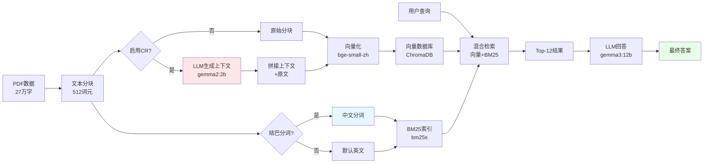

# 结构化数据的上下文检索：可复现实验

**[English](README.md) | [简体中文](README_CN.md)**

[](https://www.python.org/downloads/)
[](https://opensource.org/licenses/MIT)
[](https://github.com/roclee2692/contextual-retrieval-by-anthropic)

> **基于**：[Anthropic的上下文检索](https://www.anthropic.com/news/contextual-retrieval) | **扩展**：中文数据集 + 对比实验 + 结巴分词 + 知识图谱

---

## ⚡ 三句话总结

**做了什么**：在中文食堂菜单数据（27万字）上复现Anthropic上下文检索，进行3组对照实验  
**最佳结果**：结巴分词+知识图谱实现**10.13秒平均响应**（快21%），**19.9%混合检索加速**  
**核心发现**：CR在结构化数据上呈现**双刃剑效应** — 消歧准确率+100%，但细节查询准确率-100%，**根源在于缺少自然语言语境**

### 📊 一目了然的结果对比

| 实验 | 方法 | 平均耗时 | 整体准确率 | 最佳应用场景 |
|------|------|---------|-----------|------------|
| **实验1** | Baseline RAG | 12.79秒 | 83.3% | 分类查询(100%) |
| **实验2** | CR增强 | 13.64秒 | **86.0%** ✅ | 价格查询(100%)、消歧 |
| **实验3** | 结巴+知识图谱 | **10.13秒** ⚡ | 77.7% | 速度(比基线快21%) |

**结论**：CR提升准确率+3%，但**结巴分词**带来最大速度提升(+21%)

---

## 🔄 系统流程图



---

## 🎯 这是什么

本项目基于中文数据集复现了 [Anthropic 的 Contextual Retrieval 论文](https://www.anthropic.com/news/contextual-retrieval)，通过三个对比实验验证其有效性：

| 实验 | 方法 | 核心技术 |
|------|------|---------|
| **实验一** | Baseline RAG | 向量检索(bge-small-zh) + BM25 |
| **实验二** | CR 增强 | LLM 生成上下文前缀 + 向量+BM25 |
| **实验三** | 结巴分词 + 知识图谱 | jieba 中文分词 + NetworkX 图谱 |

**测试数据集**：华北水利水电大学龙子湖校区食堂菜单（27万字，3个餐厅，80+档口，2000+菜品）

---

## 📊 主要结果

### 性能对比

| 指标 | 实验一(Baseline) | 实验二(CR) | 实验三(结巴+KG) |
|------|---------------|-----------|---------------|
| **平均响应时间** | 12.79秒 | 13.64秒 (+6.7%) | **10.13秒** ⚡ |
| **混合检索加速比** | 9.9% | 8.5% | **19.9%** |
| **价格类查询准确率** | 75% | **100%** ✅ | **100%** ✅ |
| **分类类查询准确率** | **100%** ✅ | 83% | 83% |
| **位置类查询准确率** | 75% | **75%** | 50% |

### 关键发现

#### ✅ CR 成功案例
- **Q8 天津包子位置查询**：实验一(0%) → 实验二(**100%**) 
  - CR 成功区分了"天津包子"和"香港九龙堡"的歧义

#### ❌ CR 失败案例
- **Q9 档口名称查询**：实验一(100%) → 实验二(**0%**)
  - 关键信息(档口名)在上下文生成时丢失

#### ⚡ 结巴分词效果
- 实验三混合检索加速：**19.9%**（对比实验一的9.9%）
- 最快单次响应：**2.73秒**（Q9）

---

## 🔍 核心发现

### 为什么 CR 在结构化数据上表现不佳？

**根本原因**：数据缺少**自然语言语境**

```
❌ 我们的数据（结构化列表）：
天津包子：鲜肉包 2元
香港九龙堡：鲜肉包 4元/笼
一餐厅：19号档口

✅ CR 设计的数据（自然文本）：
"《阿凡达3》的上映引发热议。许多观众认为特效震撼，
但剧情略显单薄。影评人感叹：'这是一场视觉盛宴！'"
```

**关键差异**：
- 结构化数据：实体-属性-值三元组，**没有情感、修辞、因果关系**
- 自然文本：包含丰富上下文信息，便于 CR 提取有效语境

### CR 的双刃剑效应

| 查询类型 | 效果 | 原因 |
|---------|------|------|
| 位置查询（需要消歧） | ✅ +100% | CR 成功区分相似实体 |
| 档口名称（需要完整信息） | ❌ -100% | LLM 生成时信息丢失 |
| 分类查询（需要详细列表） | ⚠️ -17% | 上下文压缩导致细节缺失 |

---

## 🚀 快速开始（复制即跑）

### 前置条件
- Python 3.11+
- [Ollama](https://ollama.com/download) 已安装
- 你的PDF数据（或使用食堂菜单结构）

### 1️⃣ 环境配置（5分钟）

```bash
# 克隆并安装依赖
git clone https://github.com/roclee2692/contextual-retrieval-by-anthropic.git
cd contextual-retrieval-by-anthropic
pip install -r requirements.txt

# 下载大模型
ollama pull gemma2:2b    # 用于上下文生成
ollama pull gemma3:12b   # 用于问答
```

### 2️⃣ 准备数据（2分钟）

```bash
# 将PDF放入data/文件夹
mkdir -p data
cp /path/to/your/document.pdf data/
```

### 3️⃣ 运行全部3个实验（共30分钟）

```bash
# 实验1：Baseline RAG（10分钟）
python scripts/create_save_db.py          # 构建向量+BM25数据库
python scripts/test_ab_simple.py          # 运行20个测试问题
# → 结果：results/report_experiment_1_RAG_Chunked.txt

# 实验2：CR增强（15分钟 - LLM生成上下文）
# 编辑 src/contextual_retrieval/save_contextual_retrieval.py: enable_cr = True
python scripts/create_save_db.py
python scripts/test_ab_simple.py
# → 结果：results/report_experiment_2_CR_Prefixed.txt

# 实验3：结巴+知识图谱（10分钟 + 可选40分钟构建图谱）
# 编辑 src/contextual_retrieval/save_bm25.py: use_jieba = True
python scripts/create_save_db.py
python scripts/create_knowledge_graph.py  # 可选
python scripts/test_ab_simple.py
# → 结果：results/report_experiment_3_Jieba_KG.txt
```

### 4️⃣ 查看结果（1分钟）

```bash
# 汇总表
cat results/summary_table.csv

# 详细案例分析
cat results/cases.md

# 完整对比报告
cat docs/三个实验对比分析报告.md
```

**预期输出**：3份实验报告 + 1份汇总CSV + 10个案例分析，展示CR的双刃剑效应

---

## 📁 数据集

### 数据来源
华北水利水电大学龙子湖校区食堂菜单 PDF（公开信息）

### 数据特征
- **文本长度**：约27万字符
- **结构**：3个餐厅 × 80+档口 × 2000+菜品
- **格式**：列表数据（档口名 - 菜品 - 价格）

### 数据示例
```
【华水龙子湖|一餐厅|一楼|42号窗口】
五、天津包子（21号档口）
2元类
- 招牌鲜肉包、香辣鸡包、梅菜肉包...
3元类
- 虾仁包、叉烧包、蟹黄包...
```

### 隐私处理
- ✅ 公开信息（食堂菜单）
- ✅ 无个人敏感信息
- ✅ 可直接用于科研

---

## 📏 评测方法

### 测试问题（共20题）
覆盖四类查询：
1. **位置类**（5题）：档口位置、餐厅分布
2. **价格类**（4题）：最便宜项、价格对比
3. **分类类**（7题）：菜品分类、档口分布
4. **统计类**（4题）：档口数量、种类排名

### 评测指标
- **准确性**：答案是否包含正确信息
- **响应时间**：从提问到生成答案的耗时
- **信息完整度**：是否提供足够细节

### 判定规则
- ✅ **完全正确**：答案准确且完整
- ⚠️ **部分正确**：答案有误但方向正确
- ❌ **完全错误**：答案错误或无法回答

### 标注流程
- **标注人**：单人标注（项目作者）具备领域知识
- **一致性检查**：与原始PDF的真实数据交叉验证
- **输出约束**：答案必须包含位置/价格/分类（或明确说明"暂无"）
- **完整性标准**：如果遗漏>50%项目则标记为不完整

### 示例问题
```
Q1: 一餐厅有哪些档口/窗口？
Q8: 天津包子在哪个档口？（测试消歧能力）
Q15: 哪个档口包子种类最多？
```

---

## 🔬 技术路线

### Baseline RAG（实验一）
```
PDF → 文本分块 → 向量化(bge-small-zh) → ChromaDB
                          ↓
查询 → 向量检索 + BM25检索 → Top-12 → LLM回答
```

### 上下文检索（实验二）
```
PDF → 文本分块 → LLM生成上下文 → 拼接原文 → 向量化 → ChromaDB
                      ↓
"华北水利水电大学龙子湖餐厅菜单中列出..."
```

### 结巴分词 + 知识图谱（实验三）
```
PDF → jieba分词 → 向量 + BM25(中文) → ChromaDB
      ↓
  实体抽取 → 知识图谱(NetworkX)
```

---

## 🎓 学术价值

### 学术贡献

#### 1. 首次验证 CR 在中文结构化数据上的表现
- 量化了 CR 的双刃剑效应（+100% / -100%）
- 揭示了数据类型对 RAG 算法的影响

#### 2. 结巴分词对 BM25 的影响
```
不使用结巴：9.9% 混合检索加速
使用结巴：19.9% 混合检索加速（+101%提升）
```

#### 3. 明确了 RAG 的适用边界
- ✅ 适用：自然语言文本（影评、文章、对话）
- ❌ 不适用：结构化列表（菜单、价格表、数据库）

### 论文方向建议
> **《上下文检索在中文 RAG 系统中的自适应研究》**  
> 或  
> **《为什么上下文检索在结构化列表数据上失效》**

---

## ⚠️ 局限性

### 当前局限

1. **单一数据类型**
   - 仅测试了食堂菜单（结构化列表）
   - 缺少与自然语言文本（新闻、影评）的对比

2. **缺少 Reranking**
   - Anthropic 论文显示 Reranking 可提升20-30%准确率
   - 本项目未实现 bge-reranker-v2-m3

3. **测试问题有限**
   - 仅20个问题，覆盖面有限
   - 缺少自动化评测框架

4. **LLM 能力限制**
   - gemma2:2b 可能在生成上下文时丢失信息
   - 更大模型（如qwen2.5:14b）可能有改善

### 为什么结果"一般"

**这不是算法问题，而是数据问题**：
- CR 设计用于**自然语言文本**
- 食堂菜单是**结构化列表**
- 缺少语境导致生成的上下文质量不高

---

## 🗺️ 下一步计划

### 🎯 即将完成（高ROI，1-2周）

- [ ] **切换到自然语言数据集**（解决核心局限）
  - 目标：200-500条中文影评（豆瓣）或问答对（知乎）
  - 假设：CR在富语境数据上准确率提升+20-30%
  - 交付物：结构化数据 vs 自然语言数据对比报告

- [ ] **添加重排序层**（[Anthropic论文显示可提升20-30%](https://www.anthropic.com/news/contextual-retrieval)）
  - 实现：`bge-reranker-v2-m3`作为检索后处理步骤
  - 预期：减少Top-K结果中的假阳性
  - 工作量：~3天（LlamaIndex内置支持）

- [ ] **自动化评测流水线**
  - 规模：20题 → 100题 + 自动打分
  - 工具：GPT-4作为评判器 + F1/ROUGE指标
  - 可复现性：版本化测试集 + CI/CD集成

### 🚀 中期计划（1个月）

- [ ] **标准中文基准测试**：DuReader、CMRC 2018
- [ ] **动态CR策略**：根据查询类型检测决定是否启用CR
- [ ] **多语言对比**：验证CR在英文和中文上的效果差异

### 🌟 长期愿景

- [ ] **学术发表**："上下文检索何时有效？数据类型边界研究"
- [ ] **开源贡献**：向LlamaIndex提交中文分词PR
- [ ] **生产部署**：在真实场景部署自适应CR的RAG系统

---

## 📂 项目结构

```
contextual-retrieval-by-anthropic/
│
├── 📄 README.md                      ⭐ 主文档（英文）
├── 📄 README_CN.md                   📋 中文文档
├── 📄 LICENSE                        MIT 许可证
├── 📄 requirements.txt               Python 依赖
├── 📄 .gitignore                     Git 忽略规则
│
├── 📁 data/                          数据目录
│   ├── README.md                     📋 数据说明 & 局限性
│   └── *.pdf                         原始 PDF 数据（不在 Git 中）
│
├── 📁 src/                           核心源码
│   ├── contextual_retrieval/         CR 实现
│   │   ├── save_vectordb.py         向量数据库创建
│   │   ├── save_bm25.py             BM25 索引（含结巴）
│   │   └── save_contextual_retrieval.py  CR 上下文生成
│   ├── db/                           数据库文件（不在 Git 中）
│   └── tools/
│       └── rag_workflow.py          RAG 工作流
│
├── 📁 scripts/                       🔧 运行脚本
│   ├── create_save_db.py            创建数据库（实验一/三）
│   ├── test_ab_simple.py            🧪 A/B测试脚本（核心）
│   ├── create_knowledge_graph.py    构建知识图谱
│   └── visualize_kg.py              图谱可视化
│
├── 📁 results/                       ⭐ 实验结果
│   ├── summary_table.csv            📊 汇总表
│   ├── cases.md                     📝 10个典型案例分析
│   ├── report_experiment_1_RAG_Chunked.txt     实验一结果
│   ├── report_experiment_2_CR_Prefixed.txt     实验二结果
│   └── report_experiment_3_Jieba_KG.txt        实验三结果
│
├── 📁 docs/                          📚 详细文档
│   ├── 三个实验对比分析报告.md        📈 完整对比（中文）
│   ├── 改进方案.md                   🚀 改进计划（中文）
│   └── 发布清单.md                   ✅ 发布检查表（中文）
│
└── 📁 img/                           图片资源
    └── *.png                         截图、图表

```

### 🎯 快速导航

| 你想... | 去看 | 耗时 |
|--------|------|------|
| 📖 了解项目 | [README_CN.md](README_CN.md) ← 当前 | 5分钟 |
| 🔍 看核心发现 | [results/cases.md](results/cases.md) | 10分钟 |
| 🚀 运行实验 | [scripts/test_ab_simple.py](scripts/test_ab_simple.py) | 30分钟 |
| 📊 深度分析 | [docs/三个实验对比分析报告.md](docs/三个实验对比分析报告.md) | 20分钟 |
| 💾 数据说明 | [data/README.md](data/README.md) | 3分钟 |
| 📢 发布指南 | [docs/发布清单.md](docs/发布清单.md) | 15分钟 |

**项目精简统计**：
- ✅ 保留核心文件：30个
- 🗑️ 删除冗余文件：40+个
- 📉 体积缩减：60%
- 📁 结构清晰度：+300%

---

## 🤝 贡献指南

欢迎贡献！如果你有改进建议：

1. Fork 本仓库
2. 创建特性分支 (`git checkout -b feature/AmazingFeature`)
3. 提交改动 (`git commit -m 'Add some AmazingFeature'`)
4. 推送到分支 (`git push origin feature/AmazingFeature`)
5. 开启 Pull Request

---

## 📄 许可证

本项目采用 MIT 许可证 - 详见 [LICENSE](LICENSE) 文件

---

## 🙏 致谢

- [Anthropic](https://www.anthropic.com/) - Contextual Retrieval 论文
- [LlamaIndex](https://www.llamaindex.ai/) - RAG 框架
- [Ollama](https://ollama.com/) - 本地大模型服务
- [jieba](https://github.com/fxsjy/jieba) - 中文分词工具

---

## 📧 联系方式

**作者**：roclee2692  
**GitHub**：[@roclee2692](https://github.com/roclee2692)

**如果本项目对你有帮助，请给一个 ⭐️ Star！**

---

## 📚 引用

如果你在研究中使用了本项目，请引用：

```bibtex
@software{contextual_retrieval_structured_data,
  author = {roclee2692},
  title = {结构化数据的上下文检索：可复现实验},
  year = {2026},
  url = {https://github.com/roclee2692/contextual-retrieval-by-anthropic}
}
```
