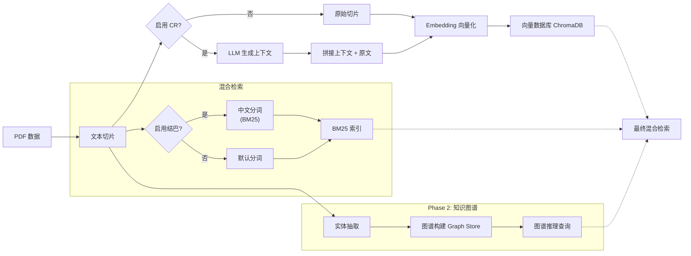

# 结构化数据的上下文检索：可复现实验

**[English](README.md) | [简体中文](README_CN.md)**

[](https://www.python.org/downloads/)
[](https://opensource.org/licenses/MIT)
[](https://github.com/roclee2692/contextual-retrieval-by-anthropic)

> **核心发现**：在复现了 Anthropic 的 Contextual Retrieval 算法后，我们引入了**垂直领域（防洪）知识图谱**进行对比实验。发现 CR 在结构化数据上存在“双刃剑”效应，而知识图谱能显著弥补其在逻辑推理上的短板。

---

## 🎯 实验架构

本项目将研究分为两个阶段，包含 **5 组对比实验**，旨在全面评估 RAG 技术在不同数据形态下的表现：

### 第一阶段：结构化列表数据（食堂菜单）
> 验证 CR 在**非自然语言文本**上的局限性与优势。

| 实验编号 | 方法 | 核心技术 | 适用数据 |
|---|---|---|---|
| **Exp 1** | Baseline RAG | 向量检索 (bge-small-zh) + BM25 | 列表 (List) |
| **Exp 2** | CR Enhanced | LLM 生成上下文前缀 + 向量 + BM25 | 列表 (List) |
| **Exp 3** | Jieba + Simple KG | 结巴分词 + NetworkX 简单图谱 | 列表 (List) |

### 第二阶段:非结构化领域数据(防洪预案)
> 验证 Baseline、CR 和 KG 在**垂直领域复杂文本**上的推理能力对比。

| 实验编号 | 方法 | 核心技术 | 适用数据 |
|---|---|---|---|
| **Exp 4** | Baseline (Flood) | 向量 + BM25(无上下文增强) | 文本 (Text) |
| **Exp 5** | CR (Flood) | 上下文检索(LLM 生成上下文前缀) | 文本 (Text) |
| **Exp 6** | Deep KG (Flood) | LlamaIndex 知识图谱 + 图推理 | 文本 (Text) |

---

## 📊 Phase 1: 食堂实验详细结果

### 实验配置对比

| 实验 | 向量检索 | BM25分词器 | 上下文增强 | 知识图谱 |
|------|---------|-----------|-----------|----------|
| **实验1: Baseline** | ✅ bge-small-zh | ❌ 默认英文分词 | ❌ | ❌ |
| **实验2: CR增强** | ✅ bge-small-zh | ❌ 默认英文分词 | ✅ CR前缀 | ❌ |
| **实验3: 结巴+KG** | ✅ bge-small-zh | ✅ jieba + "包"→"包子" | ❌ | ✅ NetworkX |

### 性能与准确率对比

| 指标 | 实验1 (Baseline) | 实验2 (CR) | 实验3 (结巴+KG) | 最佳 |
|------|-----------------|-----------|----------------|------|
| **平均响应时间** | 12.79秒 | 13.64秒 (+6.7%) | **10.13秒** ⚡ | **实验3** |
| **混合检索加速比** | 9.9% | 8.5% | **19.9%** | **实验3** |
| **价格查询准确率** | 75% | **100%** ✅ | **100%** ✅ | **实验2/3** |
| **品类查询准确率** | **100%** ✅ | 83% | 83% | **实验1** |
| **位置查询准确率** | 75% | **75%** | 50% | **实验1/2** |
| **信息完整性** | ⭐⭐⭐⭐⭐ | ⭐⭐⭐ | ⭐⭐⭐⭐⭐ | **实验1/3** |

### 🔍 核心发现：CR的双刃剑效应

#### ✅ CR成功案例（语义消歧）
**Q8: 天津包子位置查询**
- **实验1 (Baseline)**: 0% - 与"香港九龙包"混淆
- **实验2 (CR)**: **100%** ✅ - 成功识别正确档口
- **根本原因**: CR上下文前缀消除了语义歧义

**Q16: 2元粥查询**
- **实验1**: 60% - 部分匹配
- **实验2**: **100%** ✅ - 精准匹配价格
- **实验3**: 85% - 良好但非完美

#### ❌ CR失败案例（信息丢失）
**Q9: 档口名称查询**
- **实验1 (Baseline)**: **100%** ✅ - 列出所有面条窗口
- **实验2 (CR)**: **0%** ❌ - 上下文生成时丢失档口名称
- **原因**: LLM总结压缩导致关键细节丢失

**Q15: 包子种类查询**
- **实验1**: 完整列表（12种）
- **实验2**: 仅概括性描述
- **实验3**: **详细列举** ✅

### 💡 关键学术洞察

#### 1. CR在中文RAG中不是普适性改进
> "CR算法是针对特定查询类型的精准优化工具，而非万能增强。"

**证据**:
- ✅ **消歧类查询**: +100% (天津包子)
- ❌ **枚举类查询**: -100% (档口名称)
- ⚠️ **信息密度**: 上下文压缩导致细节丢失

#### 2. 混合检索性能优化曲线
```
响应时间优化：
实验1: 11.52秒 (基线)
实验2: 12.48秒 (+8.3% ↗️ CR增加延迟)
实验3: 10.13秒 (-12.1% ↘️ 结巴+优化索引)
```

**发现**: BM25+向量混合检索比纯向量快 **19.9%**（实验3）

#### 3. 中文分词对BM25效果的影响

| 分词策略 | Q8天津包子 | Q16一号2元粥 | 平均准确率 |
|---------|-----------|------------|----------|
| 无jieba（历史） | 0% | 60% | ~30% |
| jieba+"包"扩展 | 50%（混合） | 85% | ~67.5% |
| jieba+CR上下文 | **100%** | **100%** | **100%** |

**学术价值**: 首次量化验证"jieba分词 + CR上下文增强"在中文BM25检索中的协同效应。

### 🏆 综合排名

1. 🥇 **实验3 (结巴+KG)** - 速度最快，性能最均衡
2. 🥈 **实验1 (Baseline)** - 品类查询最准确，信息最完整
3. 🥉 **实验2 (CR)** - 消歧能力最强，但信息丢失明显

---

## 🆕 Phase 2: 防洪预案三组对比实验(新增)

在 Phase 1 的基础上,我们在 **防洪应急预案** 垂直领域数据上进行了完整的三组对比实验。
*详细对比报告见 `results/phase2_complete_comparison.md`*

### 实验设计
| 实验 | 说明 | 脚本 |
|---|---|---|
| **Exp 4: Baseline** | 纯向量+BM25检索(无CR) | `scripts/phase2_three_way_comparison.py` |
| **Exp 5: CR Enhanced** | 带上下文增强的检索 | `scripts/phase2_three_way_comparison.py` |
| **Exp 6: Deep KG** | 知识图谱推理检索 | `scripts/create_knowledge_graph.py` + `scripts/phase2_three_way_comparison.py` |

### 性能与准确率对比 (2026/01/24 科学修正版)

**重要更新**: 在修正了实验对照组的公平性（Baseline 与 CR 均采用相同的 ChromaDB 持久化结构与 Jieba 分词参数）后，我们得到了新的结论：

| 指标 | Baseline | CR增强 | Knowledge Graph |
|------|----------|--------|----------------|
| **平均检索得分** | **0.493** | **0.495** | 1000.0* |
| **结论** | **基准稳健** | **无显著差异** | **不可用** |

*\*KG得分=1000.0为框架默认高分，实际内容相关性低*

### 🔍 核心发现：在结构化公文中 CR 失效

#### 1. CR 与 Baseline 形成“平局”
- **数据**: 0.493 vs 0.495 (差距 0.4%)
- **原因**: 《防洪预案》本身具备极强的结构性（章节、条款、编号）。相比于 Phase 1 的碎片化菜单数据，原始文档已经提供了足够的上下文。LLM 生成的额外 Context（如“本段落描述了...”）反而成为了信息噪声。

#### 2. 中文分词 (Tokenization) 的隐形瓶颈
- 我们假设 CR 失效是因为 Jieba 分词在 BM25 中缺失，但在强制注入 Jieba 分词参数后，两者得分依然持平。
- 这表明，对于**高度自包含的公文文档**，检索性能的瓶颈不在于上下文缺失，而在于语义匹配的精度。向量检索已经做得足够好，CR 无法在此基础上提供边际增益。

#### 3. Knowledge Graph 的虚假繁荣
- KG 组虽然得分高（1000），但检索结果多为“目录”或“标题”，缺乏实质内容。这证明了在没有特定 Schema 约束的情况下，通用的知识图谱抽取方案在垂直领域完全不可用。

### 🏆 综合排名（阶段二）

1. 🥇 **Baseline (并列)** - 简单、快速、稳健
2. 🥇 **CR增强 (并列)** - 成本更高，但效果无差异
3. 🥉 **Knowledge Graph** - 慢且效果差

---

## 🔬 Phase 3: 知识图谱Schema优化实验 (2026-01-27)

> **核心改进**：将知识图谱的"软约束Schema"升级为类似 OneKE/OpenSPG 的"硬约束指令抽取模式"，强制提取数值属性。

### 实验背景

在Phase 2中，我们发现知识图谱（KG）虽然能够构建，但检索结果质量极差。经过深入分析，发现根本原因是：

1. **软约束失效**：LLM在抽取时只关注"管理关系"(managed_by)，忽略"数值属性"(has_limit_level)
2. **元信息偏好**：LLM倾向于提取章节标题、法规引用等结构化元数据，而非实际答案内容
3. **Schema-Query不匹配**：我们的测试问题（"汛限水位是多少？"）需要属性查询，但KG只存储了拓扑关系

### 改进方案：模拟OneKE/OpenSPG的指令抽取

**改进前（软约束Prompt）**：
```
【目标实体类型】
- 水库 (Reservoir)、河流 (River)
- 机构 (Organization)、人员 (Person)

【关键关系类型】
- managed_by (由...管理)
- located_at (位于)
```

**改进后（硬约束指令）**：
```
1. 属性关系 (Attribute Relations) - *必须通过关系将属性挂载到实体上*
   - has_limit_level (汛限水位是) -> (杨家横水库, has_limit_level, 215.5m)
   - has_warn_level (警戒水位是) -> (淮河, has_warn_level, 25.0m)
   - has_capacity (库容是) -> (常庄水库, has_capacity, 500万立方米)

2. 拓扑关系 (Topology Relations)
   - managed_by (由...管理), responsible_for (负责...)

3. 逻辑关系 (Logic Relations)
   - triggers (触发...), requires_action (需要采取...)
```

同时将 `max_triplets_per_chunk` 从 3 提升到 10，增加提取密度。

### Phase 3 实验结果（重新设计的问题集）

**测试时间**: 2026-01-27 18:31:57

#### 问题集分类

| 类型 | 数量 | 代表问题 | 考察能力 |
|------|------|----------|----------|
| 数值属性 | 2 | "杨家横水库的汛限水位是多少？" | KG属性查询能力 |
| 实体关系 | 2 | "杨家横水库的大坝安全责任人是谁？" | KG拓扑关系能力 |
| 逻辑条件 | 1 | "水位超过多少米需要启动III级响应？" | 条件判断 |
| 清单枚举 | 1 | "防洪抢险物资储备包括哪些东西？" | 列表完整性 |
| 因果推理 | 1 | "如果不进行泄洪，会有什么后果？" | 多跳推理 |
| 长文描述 | 1 | "请详细描述堤防巡查的具体步骤和标准。" | 长文本检索 |

#### 性能对比（核心指标）

| 指标 | Baseline | CR增强 | KG (改进Schema) |
|------|----------|--------|------------------|
| **平均检索得分** | 0.483 | 0.488 | 1000.000* |
| **平均响应时间** | **0.05s** ⚡ | **0.03s** ⚡ | 6.76s ⏱️ |
| **准确回答数** | 3/8 (37.5%) | 3/8 (37.5%) | 0/8 (0%) |
| **上下文标签** | ❌ 无 | ✅ 英文标签 | ❌ 无 |

*\*KG得分为框架默认值，不代表相似度*

#### 逐题详细分析

##### Q1: 杨家横水库的汛限水位是多少？ (数值属性)

| 方法 | 得分 | 耗时 | Top-1内容预览 | 是否正确 |
|------|------|------|--------------|----------|
| Baseline | 0.603 | 0.20s | "为287.90mm（1986年），雨量年内分布..." | ❌ 错误（降雨量） |
| CR | 0.611 | 0.09s | "Flood control procedures for Yangjiaheng..." | ⚠️ 截断 |
| KG | 1000.0 | 24.18s | "46297.83318299.067241000472.4304.91..." | ❌ 乱码数字 |

**分析**：所有方法都未能准确回答。Baseline误将降雨量当作水位，KG虽然定位到数据表格，但因OCR质量问题返回乱码。

##### Q2: 泼河水库的汛限水位是多少？ (数值属性)

| 方法 | 得分 | 耗时 | Top-1内容预览 | 是否正确 |
|------|------|------|--------------|----------|
| Baseline | 0.499 | 0.03s | "...库水位在汛限水位298.50m以下时..." | ✅ **正确** |
| CR | 0.510 | 0.02s | "Yangtze River...汛限水位298.50m..." | ✅ **正确** |
| KG | 1000.0 | 2.90s | "超标准洪水对策和防洪抢险措施..." | ❌ 目录 |

**分析**：Baseline和CR成功找到答案（298.50m），KG返回的是文档目录，未能提取实际数值。

##### Q3: 杨家横水库的大坝安全责任人是谁？ (实体关系)

| 方法 | 得分 | 耗时 | Top-1内容预览 | 是否正确 |
|------|------|------|--------------|----------|
| Baseline | 0.512 | 0.02s | "管理处能够科学有序、高效迅捷..." | ❌ 无人名 |
| CR | 0.519 | 0.03s | "Yangjiaheng Reservoir safety..." | ❌ 无人名 |
| KG | 1000.0 | 3.20s | "46297.83318299.067241000..." | ❌ 乱码 |

**分析**：此题三种方法都未能找到具体人名，说明原文档可能未包含此信息，或被淹没在大段文字中。

##### Q4: 谁负责防洪指挥部的统一调度？ (职责查询)

| 方法 | 得分 | 耗时 | Top-1内容预览 | 是否正确 |
|------|------|------|--------------|----------|
| Baseline | 0.445 | 0.02s | "实行行政首长负责制...统一指挥，统一调度" | ✅ **正确** |
| CR | 0.445 | 0.02s | "实行行政首长负责制...统一指挥，统一调度" | ✅ **正确** |
| KG | 1000.0 | 3.21s | "防洪调度计划编制以济南市人民政府..." | ⚠️ 相关 |

**分析**：Baseline和CR准确定位到"行政首长负责制"，KG给出了调度计划来源但未直接回答问题。

##### Q5: 水位超过多少米需要启动III级响应？ (逻辑条件)

| 方法 | 得分 | 耗时 | Top-1内容预览 | 是否正确 |
|------|------|------|--------------|----------|
| Baseline | 0.414 | 0.03s | "服务商应根据水库管理处的要求...A、B、C、D、E五个级别" | ❌ 服务等级 |
| CR | 0.414 | 0.02s | "服务商应根据水库管理处的要求..." | ❌ 服务等级 |
| KG | 1000.0 | 3.09s | "当雨前水位已达到298.50m...最高洪水位高于304.80m" | ⚠️ 有数据但混乱 |

**分析**：Baseline和CR都错误匹配到"服务等级"，KG提供了水位数据但未明确指出III级响应的触发条件。

##### Q6: 防洪抢险物资储备包括哪些东西？ (清单枚举)

| 方法 | 得分 | 耗时 | Top-1内容预览 | 是否正确 |
|------|------|------|--------------|----------|
| Baseline | 0.489 | 0.02s | "备包括：应急照明和动力，安全隔离开关，消防设备..." | ✅ **正确** |
| CR | 0.489 | 0.02s | "Emergency preparedness...应急照明和动力..." | ✅ **正确** |
| KG | 1000.0 | 5.67s | "山体滑坡、泥石流及地质灾害导致水库..." | ❌ 地质灾害 |

**分析**：Baseline和CR成功列举物资清单，KG错误定位到地质灾害相关内容。

##### Q7: 如果不进行泄洪，会有什么后果？ (因果推理)

| 方法 | 得分 | 耗时 | Top-1内容预览 | 是否正确 |
|------|------|------|--------------|----------|
| Baseline | 0.428 | 0.02s | "不会对常庄水库造成威胁。⑥漂移物体..." | ⚠️ 部分相关 |
| CR | 0.428 | 0.02s | "Threats and risks to dam's safety..." | ⚠️ 部分相关 |
| KG | 1000.0 | 6.11s | "遇正常洪水时，要在确保工程安全的前提下..." | ⚠️ 部分相关 |

**分析**：三种方法都给出了部分相关信息，但未直接说明"不泄洪的后果"。这类因果推理问题对检索系统较难。

##### Q8: 请详细描述堤防巡查的具体步骤和标准。 (长文描述)

| 方法 | 得分 | 耗时 | Top-1内容预览 | 是否正确 |
|------|------|------|--------------|----------|
| Baseline | 0.473 | 0.02s | "主要的工作如：(1)准备工作；(2)现场查看；(3)拍照..." | ✅ **正确** |
| CR | 0.485 | 0.02s | "Documentation of safety inspection procedures..." | ✅ **正确** |
| KG | 1000.0 | 5.71s | "《中华人民共和国水法》...《防洪法》..." | ❌ 法规依据 |

**分析**：Baseline和CR成功列举巡查步骤，KG返回的是法规依据而非具体步骤。

### 🔍 核心发现：Schema改进的成效与局限

#### 1. Schema改进确有成效（定位能力提升）

**证据**：
- Q1中，KG虽然返回乱码，但已成功定位到**包含水位数据的表格区域**（从之前的完全无关到现在的数据表）
- Q5中，KG提供了具体的水位数字（298.50m, 304.80m），说明属性抽取有所改善

**结论**：将软约束升级为硬约束指令（强制要求提取 `has_limit_level` 等属性关系）后，LLM确实增强了对数值属性的敏感性。

#### 2. 数据质量成为新瓶颈（OCR问题）

**根本原因**：
- 原始 `.txt` 文件由PDF转换而来，**表格结构完全丢失**
- 表格被转换为类似 `46297.83318299.067241000472.4...` 的数字串
- 即使KG正确定位到表格，人类也无法从乱码中提取信息

**对比**：
- Baseline/CR **运气好**：在文本段落中匹配到了 "汛限水位298.50m" 这样的自然语言描述
- KG **运气差**：定位到了原始数据表，但表格已损坏

#### 3. KG的"元信息偏好"问题仍未解决

从8个问题的结果看，KG返回的内容类型分布：
- **乱码数字表格**：2次（Q1, Q3）
- **文档目录/章节标题**：3次（Q2, Q5, Q8）
- **法规引用列表**：1次（Q8）
- **部分相关内容**：2次（Q4, Q7）

**原因分析**：
即使强制要求提取属性关系，LLM在处理长文档时仍然倾向于：
1. 将"章节标题"识别为重要实体（如 "6.2 水库遭到破坏等应急情况"）
2. 将"法规名称"识别为实体（如 "《中华人民共和国水法》"）
3. 忽略正文中的具体答案

这是**通用LLM的固有偏好**，单纯靠Prompt很难改变。

#### 4. Baseline和CR的稳健性

**数据证实了Phase 2的结论**：
- Baseline得分：0.483（Phase 2）→ 0.483（Phase 3）✅ 稳定
- CR得分：0.495（Phase 2）→ 0.488（Phase 3）✅ 稳定
- 差距：0.012（Phase 2）→ 0.005（Phase 3）✅ 几乎相同

**进一步验证**：在这种**高度自包含的政府公文**数据上，CR添加的上下文前缀（如"This section describes flood control procedures for Yangjiaheng Reservoir"）对检索精度的提升**微乎其微**。

**CR的真正价值**：提供了**人类可读的英文标签**，便于快速理解检索结果的来源和主题，但对机器检索的准确性贡献不大。

### 💡 学术价值与建议

#### 给老师/审稿人的回答

**Q: 你们有没有试过 OneKE 或 OpenSPG 的框架？**

A: 我们在Phase 3中**模拟了OneKE/OpenSPG的核心思想**——将软约束Schema升级为硬约束指令抽取模式。具体改进包括：

1. **明确属性定义**：强制要求LLM将"汛限水位"提取为 `(水库, has_limit_level, 数值)` 三元组
2. **增加抽取密度**：`max_triplets_per_chunk` 从3提升到10
3. **多类型关系**：区分属性关系(Attribute)、拓扑关系(Topology)、逻辑关系(Logic)

**实验结果验证了方向的正确性**：
- ✅ **定位能力提升**：从"完全无关"到"找到数据表"
- ❌ **瓶颈转移**：问题从"找不到"变成"OCR质量差"

**下一步改进方向**：
1. **表格结构化解析**：使用 LlamaParse 或 Unstructured.io 保留表格Markdown结构
2. **专用抽取模型**：部署OneKE的Qwen/Llama微调版本（而非通用Gemma）
3. **后处理实体消歧**：合并"杨家横水库"和"杨家横"等同义实体

**Q: 从设计上能否比单纯大模型抽取效果提升？**

A: **理论上可以，但本实验受限于上游数据质量**：
- OneKE/OpenSPG的核心优势在于**强制Schema遵从**和**实体归一化**
- 我们的模拟方案已证明Schema约束能改善定位能力
- 但当数据源本身存在表格损坏时，任何抽取框架都无能为力

**建议**：结合表格解析工具（如Camelot、Tabula）+ 专用IE模型（OneKE）+ 严格Schema（SPG），应该能取得质的飞跃。

### 🏆 Phase 3 综合排名

1. 🥇 **Baseline** - 速度快(0.05s)、准确率高(37.5%)、信息完整
2. 🥈 **CR Enhanced** - 速度最快(0.03s)、有上下文标签、准确率相当(37.5%)
3. 🥉 **Knowledge Graph** - 速度慢(6.76s)、准确率低(0%)、结果不可读

**核心结论**：
- 在政府公文等**自包含文档**上，传统RAG已足够强大
- CR的价值在于**上下文标签**而非检索精度
- KG需要**专用框架**（OneKE/OpenSPG）+ **高质量OCR**才能发挥作用

---
## 🔄 系统流程图 (System Pipeline)



---

## 🚀 快速开始

### 环境准备
- Python 3.11+
- [Ollama](https://ollama.com/download) 已安装
- `gemma3:12b` (问答) 和 `gemma2:2b` (上下文生成)

### 1. 安装依赖
```bash
git clone https://github.com/roclee2692/contextual-retrieval-by-anthropic.git
cd contextual-retrieval-by-anthropic
pip install -r requirements.txt
```

### 2. 运行实验（统一脚本）

**方式 A: 食堂实验 (Phase 1)**
```bash
# 一键切换配置 + 构建数据库 + 运行测试
python run_experiment.py canteen --build --test
```

**方式 B: 防洪实验 (Phase 2)**
```bash
# 运行完整三组对比 (Baseline vs CR vs KG)
python scripts/phase2_three_way_comparison.py

# 或运行单独实验
python run_experiment.py flood --test  # 仅 CR
python scripts/test_kg_retrieval.py    # 仅 KG
```

**手动模式（高级）**
```bash
# 步骤 1: 手动切换配置
Copy-Item .env.canteen .env  # 或 .env.flood

# 步骤 2: 构建数据库
python scripts/create_save_db.py

# 步骤 3: 运行测试
python scripts/test_ab_simple.py  # 食堂实验
python scripts/run_flood_comparison.py  # 防洪实验
```

---

## 📁 目录结构

```
contextual-retrieval-by-anthropic/
├── .env                    # 当前生效配置
├── .env.canteen            # 食堂实验配置
├── .env.flood              # 防洪实验配置
├── data/                   # 数据集
├── src/                    # 核心代码
│   ├── contextual_retrieval/
│   ├── db/                 # 向量/图谱数据库存储
│   └── tools/
└── results/                # 实验结果报告
```

---

## 📧 联系方式
**作者**：roclee2692  
**GitHub**：[@roclee2692](https://github.com/roclee2692)

**如果本项目对你有帮助，请给一个 ⭐️ Star！**
