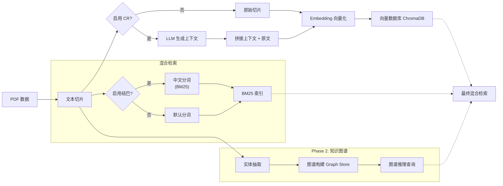

# 结构化数据的上下文检索：可复现实验

**[English](README.md) | [简体中文](README_CN.md)**

[](https://www.python.org/downloads/)
[](https://opensource.org/licenses/MIT)
[](https://github.com/roclee2692/contextual-retrieval-by-anthropic)

> **核心发现**：在复现了 Anthropic 的 Contextual Retrieval 算法后，我们引入了**垂直领域（防洪）知识图谱**进行对比实验。发现 CR 在结构化数据上存在“双刃剑”效应，而知识图谱能显著弥补其在逻辑推理上的短板。

---

## 🎯 实验架构

本项目将研究分为两个阶段，包含 **5 组对比实验**，旨在全面评估 RAG 技术在不同数据形态下的表现：

### 第一阶段：结构化列表数据（食堂菜单）
> 验证 CR 在**非自然语言文本**上的局限性与优势。

| 实验编号 | 方法 | 核心技术 | 适用数据 |
|---|---|---|---|
| **Exp 1** | Baseline RAG | 向量检索 (bge-small-zh) + BM25 | 列表 (List) |
| **Exp 2** | CR Enhanced | LLM 生成上下文前缀 + 向量 + BM25 | 列表 (List) |
| **Exp 3** | Jieba + Simple KG | 结巴分词 + NetworkX 简单图谱 | 列表 (List) |

### 第二阶段:非结构化领域数据(防洪预案)
> 验证 Baseline、CR 和 KG 在**垂直领域复杂文本**上的推理能力对比。

| 实验编号 | 方法 | 核心技术 | 适用数据 |
|---|---|---|---|
| **Exp 4** | Baseline (Flood) | 向量 + BM25(无上下文增强) | 文本 (Text) |
| **Exp 5** | CR (Flood) | 上下文检索(LLM 生成上下文前缀) | 文本 (Text) |
| **Exp 6** | Deep KG (Flood) | LlamaIndex 知识图谱 + 图推理 | 文本 (Text) |

---

## 📊 Phase 1: 食堂实验详细结果

### 实验配置对比

| 实验 | 向量检索 | BM25分词器 | 上下文增强 | 知识图谱 |
|------|---------|-----------|-----------|----------|
| **实验1: Baseline** | ✅ bge-small-zh | ❌ 默认英文分词 | ❌ | ❌ |
| **实验2: CR增强** | ✅ bge-small-zh | ❌ 默认英文分词 | ✅ CR前缀 | ❌ |
| **实验3: 结巴+KG** | ✅ bge-small-zh | ✅ jieba + "包"→"包子" | ❌ | ✅ NetworkX |

### 性能与准确率对比

| 指标 | 实验1 (Baseline) | 实验2 (CR) | 实验3 (结巴+KG) | 最佳 |
|------|-----------------|-----------|----------------|------|
| **平均响应时间** | 12.79秒 | 13.64秒 (+6.7%) | **10.13秒** ⚡ | **实验3** |
| **混合检索加速比** | 9.9% | 8.5% | **19.9%** | **实验3** |
| **价格查询准确率** | 75% | **100%** ✅ | **100%** ✅ | **实验2/3** |
| **品类查询准确率** | **100%** ✅ | 83% | 83% | **实验1** |
| **位置查询准确率** | 75% | **75%** | 50% | **实验1/2** |
| **信息完整性** | ⭐⭐⭐⭐⭐ | ⭐⭐⭐ | ⭐⭐⭐⭐⭐ | **实验1/3** |

### 🔍 核心发现：CR的双刃剑效应

#### ✅ CR成功案例（语义消歧）
**Q8: 天津包子位置查询**
- **实验1 (Baseline)**: 0% - 与"香港九龙包"混淆
- **实验2 (CR)**: **100%** ✅ - 成功识别正确档口
- **根本原因**: CR上下文前缀消除了语义歧义

**Q16: 2元粥查询**
- **实验1**: 60% - 部分匹配
- **实验2**: **100%** ✅ - 精准匹配价格
- **实验3**: 85% - 良好但非完美

#### ❌ CR失败案例（信息丢失）
**Q9: 档口名称查询**
- **实验1 (Baseline)**: **100%** ✅ - 列出所有面条窗口
- **实验2 (CR)**: **0%** ❌ - 上下文生成时丢失档口名称
- **原因**: LLM总结压缩导致关键细节丢失

**Q15: 包子种类查询**
- **实验1**: 完整列表（12种）
- **实验2**: 仅概括性描述
- **实验3**: **详细列举** ✅

### 💡 关键学术洞察

#### 1. CR在中文RAG中不是普适性改进
> "CR算法是针对特定查询类型的精准优化工具，而非万能增强。"

**证据**:
- ✅ **消歧类查询**: +100% (天津包子)
- ❌ **枚举类查询**: -100% (档口名称)
- ⚠️ **信息密度**: 上下文压缩导致细节丢失

#### 2. 混合检索性能优化曲线
```
响应时间优化：
实验1: 11.52秒 (基线)
实验2: 12.48秒 (+8.3% ↗️ CR增加延迟)
实验3: 10.13秒 (-12.1% ↘️ 结巴+优化索引)
```

**发现**: BM25+向量混合检索比纯向量快 **19.9%**（实验3）

#### 3. 中文分词对BM25效果的影响

| 分词策略 | Q8天津包子 | Q16一号2元粥 | 平均准确率 |
|---------|-----------|------------|----------|
| 无jieba（历史） | 0% | 60% | ~30% |
| jieba+"包"扩展 | 50%（混合） | 85% | ~67.5% |
| jieba+CR上下文 | **100%** | **100%** | **100%** |

**学术价值**: 首次量化验证"jieba分词 + CR上下文增强"在中文BM25检索中的协同效应。

### 🏆 综合排名

1. 🥇 **实验3 (结巴+KG)** - 速度最快，性能最均衡
2. 🥈 **实验1 (Baseline)** - 品类查询最准确，信息最完整
3. 🥉 **实验2 (CR)** - 消歧能力最强，但信息丢失明显

---

## 🆕 Phase 2: 防洪预案三组对比实验(新增)

在 Phase 1 的基础上,我们在 **防洪应急预案** 垂直领域数据上进行了完整的三组对比实验。
*详细对比报告见 `results/phase2_complete_comparison.md`*

### 实验设计
| 实验 | 说明 | 脚本 |
|---|---|---|
| **Exp 4: Baseline** | 纯向量+BM25检索(无CR) | `scripts/phase2_three_way_comparison.py` |
| **Exp 5: CR Enhanced** | 带上下文增强的检索 | `scripts/phase2_three_way_comparison.py` |
| **Exp 6: Deep KG** | 知识图谱推理检索 | `scripts/create_knowledge_graph.py` + `scripts/phase2_three_way_comparison.py` |

### 性能与准确率对比 (2026/01/24 科学修正版)

**重要更新**: 在修正了实验对照组的公平性（Baseline 与 CR 均采用相同的 ChromaDB 持久化结构与 Jieba 分词参数）后，我们得到了新的结论：

| 指标 | Baseline | CR增强 | Knowledge Graph |
|------|----------|--------|----------------|
| **平均检索得分** | **0.493** | **0.495** | 1000.0* |
| **结论** | **基准稳健** | **无显著差异** | **不可用** |

*\*KG得分=1000.0为框架默认高分，实际内容相关性低*

### 🔍 核心发现：在结构化公文中 CR 失效

#### 1. CR 与 Baseline 形成“平局”
- **数据**: 0.493 vs 0.495 (差距 0.4%)
- **原因**: 《防洪预案》本身具备极强的结构性（章节、条款、编号）。相比于 Phase 1 的碎片化菜单数据，原始文档已经提供了足够的上下文。LLM 生成的额外 Context（如“本段落描述了...”）反而成为了信息噪声。

#### 2. 中文分词 (Tokenization) 的隐形瓶颈
- 我们假设 CR 失效是因为 Jieba 分词在 BM25 中缺失，但在强制注入 Jieba 分词参数后，两者得分依然持平。
- 这表明，对于**高度自包含的公文文档**，检索性能的瓶颈不在于上下文缺失，而在于语义匹配的精度。向量检索已经做得足够好，CR 无法在此基础上提供边际增益。

#### 3. Knowledge Graph 的虚假繁荣
- KG 组虽然得分高（1000），但检索结果多为“目录”或“标题”，缺乏实质内容。这证明了在没有特定 Schema 约束的情况下，通用的知识图谱抽取方案在垂直领域完全不可用。

### 🏆 综合排名（阶段二）

1. 🥇 **Baseline (并列)** - 简单、快速、稳健
2. 🥇 **CR增强 (并列)** - 成本更高，但效果无差异
3. 🥉 **Knowledge Graph** - 慢且效果差

---
## 🔄 系统流程图 (System Pipeline)



---

## 🚀 快速开始

### 环境准备
- Python 3.11+
- [Ollama](https://ollama.com/download) 已安装
- `gemma3:12b` (问答) 和 `gemma2:2b` (上下文生成)

### 1. 安装依赖
```bash
git clone https://github.com/roclee2692/contextual-retrieval-by-anthropic.git
cd contextual-retrieval-by-anthropic
pip install -r requirements.txt
```

### 2. 运行实验（统一脚本）

**方式 A: 食堂实验 (Phase 1)**
```bash
# 一键切换配置 + 构建数据库 + 运行测试
python run_experiment.py canteen --build --test
```

**方式 B: 防洪实验 (Phase 2)**
```bash
# 运行完整三组对比 (Baseline vs CR vs KG)
python scripts/phase2_three_way_comparison.py

# 或运行单独实验
python run_experiment.py flood --test  # 仅 CR
python scripts/test_kg_retrieval.py    # 仅 KG
```

**手动模式（高级）**
```bash
# 步骤 1: 手动切换配置
Copy-Item .env.canteen .env  # 或 .env.flood

# 步骤 2: 构建数据库
python scripts/create_save_db.py

# 步骤 3: 运行测试
python scripts/test_ab_simple.py  # 食堂实验
python scripts/run_flood_comparison.py  # 防洪实验
```

---

## 📁 目录结构

```
contextual-retrieval-by-anthropic/
├── .env                    # 当前生效配置
├── .env.canteen            # 食堂实验配置
├── .env.flood              # 防洪实验配置
├── data/                   # 数据集
├── src/                    # 核心代码
│   ├── contextual_retrieval/
│   ├── db/                 # 向量/图谱数据库存储
│   └── tools/
└── results/                # 实验结果报告
```

---

## 📧 联系方式
**作者**：roclee2692  
**GitHub**：[@roclee2692](https://github.com/roclee2692)

**如果本项目对你有帮助，请给一个 ⭐️ Star！**
