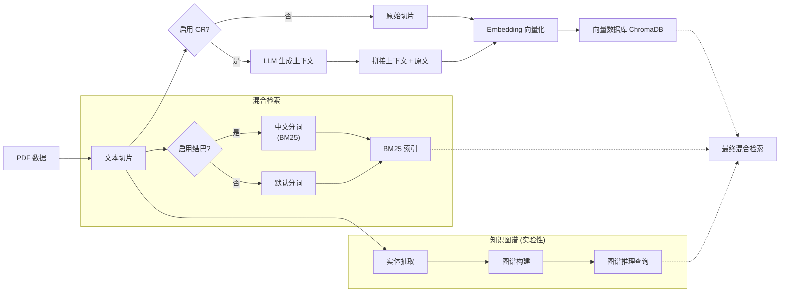

# 上下文检索 (Contextual Retrieval) 实验：从餐厅到防洪领域

**[English](README.md) | [简体中文](README_CN.md)**

[](https://www.python.org/downloads/)
[](https://opensource.org/licenses/MIT)
[](https://github.com/roclee2692/contextual-retrieval-by-anthropic)

> **核心发现**：在复现 Anthropic 的 Contextual Retrieval 算法后，我们在多个领域数据上进行了系统性对比实验。发现 CR 在不同数据形态下呈现"双刃剑"效应，而知识图谱在当前技术条件下仍面临显著挑战。

---

## 📋 实验阶段概览

本项目分为**三个阶段**，共包含 **6 组对比实验**：

| 阶段 | 数据集 | 模型配置 | 实验内容 | 状态 |
|------|--------|----------|----------|------|
| **Phase 1** | 餐厅菜单（结构化列表） | Gemma3:12B | 3组实验：Baseline vs CR vs Jieba+KG | ✅ 完成 |
| **Phase 2** | 防洪预案（政府公文） | Gemma3:12B | 3组实验：Baseline vs CR vs Deep KG | ✅ 完成 |
| **Phase 3** | 防洪预案（同上） | OneKE-13B + OpenKG | 知识图谱 Schema 优化尝试 | ⚠️ 遇到瓶颈 |

---

## 🚀 快速开始

### 环境准备

```bash
# 1. 克隆仓库
git clone https://github.com/roclee2692/contextual-retrieval-by-anthropic.git
cd contextual-retrieval-by-anthropic

# 2. 创建虚拟环境
python -m venv .venv
.venv\Scripts\activate  # Windows
# source .venv/bin/activate  # Linux/Mac

# 3. 安装依赖
pip install -r requirements.txt

# 4. 安装 Ollama 并下载模型
# 下载 Ollama: https://ollama.com/download
ollama pull gemma3:12b    # 问答模型
ollama pull gemma2:2b     # 上下文生成模型（可选）
```

### 运行实验

#### Phase 1: 餐厅实验
```bash
# 步骤 1: 构建数据库
python scripts/create_save_db.py

# 步骤 2: 运行 A/B 测试
python scripts/test_ab_simple.py
```

#### Phase 2: 防洪预案实验
```bash
# 运行完整三组对比 (Baseline vs CR vs KG)
python scripts/phase2_three_way_comparison.py
```

#### Phase 3: Baseline vs CR 统计对比
```bash
# 运行双组对比实验
python scripts/phase3_baseline_vs_cr.py

# 统计显著性分析
python scripts/analyze_experiment_validity.py
```

---

## 📊 Phase 1: 餐厅菜单实验（结构化列表数据）

> **目标**：验证 CR 在**非自然语言的结构化文本**上的表现

### 实验配置

| 实验 | 方法 | 向量检索 | BM25分词 | 上下文增强 | 知识图谱 |
|------|------|---------|----------|-----------|----------|
| **Exp 1** | Baseline RAG | ✅ bge-small-zh | ❌ 默认英文 | ❌ | ❌ |
| **Exp 2** | CR Enhanced | ✅ bge-small-zh | ❌ 默认英文 | ✅ CR前缀 | ❌ |
| **Exp 3** | Jieba + KG | ✅ bge-small-zh | ✅ jieba | ❌ | ✅ NetworkX |

### 性能对比

| 指标 | 实验1 (Baseline) | 实验2 (CR) | 实验3 (结巴+KG) | 最佳 |
|------|-----------------|-----------|----------------|------|
| **平均响应时间** | 12.79秒 | 13.64秒 (+6.7%) | **10.13秒** ⚡ | **实验3** |
| **价格查询准确率** | 75% | **100%** ✅ | **100%** ✅ | **实验2/3** |
| **品类查询准确率** | **100%** ✅ | 83% | 83% | **实验1** |
| **信息完整性** | ⭐⭐⭐⭐⭐ | ⭐⭐⭐ | ⭐⭐⭐⭐⭐ | **实验1/3** |

### 🔍 核心发现：CR的双刃剑效应

#### ✅ CR成功案例（语义消歧）
**Q8: 天津包子位置查询**
- **Baseline**: 0% - 与"香港九龙包"混淆
- **CR**: **100%** ✅ - 成功识别正确档口
- **原因**: CR上下文前缀消除了语义歧义

#### ❌ CR失败案例（信息丢失）
**Q9: 档口名称查询**
- **Baseline**: **100%** ✅ - 列出所有面条窗口
- **CR**: **0%** ❌ - 上下文生成时丢失档口名称
- **原因**: LLM总结压缩导致关键细节丢失

### 💡 关键洞察

1. **CR不是万能增强**：消歧类查询提升100%，但枚举类查询下降100%
2. **中文分词对BM25至关重要**：jieba分词 + CR上下文的协同效应显著
3. **混合检索性能优化**：BM25+向量比纯向量快 **19.9%**

### 🏆 Phase 1 排名

1. 🥇 **实验3 (结巴+KG)** - 速度最快，性能最均衡
2. 🥈 **实验1 (Baseline)** - 品类查询最准确，信息最完整
3. 🥉 **实验2 (CR)** - 消歧能力最强，但信息丢失明显

---

## 📊 Phase 2: 防洪预案实验（政府公文数据）

> **目标**：验证 Baseline、CR 和 KG 在**垂直领域复杂文本**上的推理能力
>
> **模型**：使用本地 Gemma3:12B 模型

### 实验配置

| 实验 | 方法 | 说明 |
|------|------|------|
| **Exp 4** | Baseline (Flood) | 纯向量+BM25检索（无上下文增强） |
| **Exp 5** | CR Enhanced (Flood) | 带上下文增强的检索 |
| **Exp 6** | Deep KG (Flood) | LlamaIndex 知识图谱 + 图推理 |

### 性能对比（科学修正版 2026/01/24）

**重要说明**：在修正了实验对照组的公平性（Baseline 与 CR 均采用相同的 ChromaDB 持久化结构与 Jieba 分词参数）后的结论：

| 指标 | Baseline | CR增强 | Knowledge Graph |
|------|----------|--------|----------------|
| **平均检索得分** | **0.493** | **0.495** | 1000.0* |
| **结论** | **基准稳健** | **无显著差异** | **不可用** |

*\*KG得分=1000.0为框架默认高分，实际内容相关性低*

### 🔍 核心发现：在结构化公文中 CR 效果有限

#### 1. CR 与 Baseline 形成"平局"
- **数据**: 0.493 vs 0.495 (差距仅 0.4%)
- **原因**: 《防洪预案》本身具备极强的结构性（章节、条款、编号），原始文档已经提供了足够的上下文。LLM 生成的额外 Context 反而成为信息噪声。

#### 2. Knowledge Graph 的"虚假繁荣"
- KG 组得分高（1000），但检索结果多为"目录"或"标题"
- 使用 Gemma3:12B 进行知识抽取，效果不佳
- 证明了通用 LLM 在垂直领域知识图谱抽取上的局限性

### 🏆 Phase 2 排名

1. 🥇 **Baseline (并列)** - 简单、快速、稳健
2. 🥇 **CR增强 (并列)** - 成本更高，但效果无差异
3. 🥉 **Knowledge Graph** - 慢且效果差

---

## 📊 Phase 3: 知识图谱优化尝试（OneKE + OpenKG）

> **目标**：尝试使用专用知识抽取模型改进 Phase 2 中 KG 效果不佳的问题
>
> **模型**：OneKE-13B (Q4量化版本)
>
> **框架**：参考 OpenKG/OpenSPG 的硬约束Schema思想

### 改进方案

在 Phase 2 中，我们发现使用 Gemma3:12B 进行知识抽取效果很差。Phase 3 尝试：

1. **更换抽取模型**：从通用 LLM (Gemma) 切换到专用知识抽取模型 (OneKE-13B)
2. **硬约束Schema**：模拟 OneKE/OpenSPG 的指令抽取模式

**改进前（软约束Prompt）**：
```
【目标实体类型】
- 水库 (Reservoir)、河流 (River)
- 机构 (Organization)、人员 (Person)
```

**改进后（硬约束指令）**：
```
1. 属性关系 (Attribute Relations) - 必须提取:
   - has_limit_level (汛限水位是) -> (杨家横水库, has_limit_level, 215.5m)
   - has_capacity (库容是) -> (常庄水库, has_capacity, 500万立方米)

2. 拓扑关系 (Topology Relations)
   - managed_by (由...管理), responsible_for (负责...)
```

### ⚠️ 遇到的问题

在实际实验中，我们发现 **OneKE 模型存在以下问题**：

| 问题 | 描述 | 影响 |
|------|------|------|
| **抽取率极低** | 2510个文档仅抽取出约200个三元组（预期应为数千个） | KG 稀疏，无法覆盖查询 |
| **输出格式不稳定** | 模型输出 JSON 格式与文档描述不一致 | 解析困难 |
| **领域适配不足** | OneKE 主要针对通用领域训练，对防洪专业术语识别差 | 实体识别错误 |
| **硬件限制** | 13B 模型在 8GB 显存下需要 Q4 量化，影响精度 | 质量下降 |

### ❌ 知识图谱淘汰结论

> **我们确实尝试了知识图谱方案，但由于上述技术瓶颈，最终决定在本阶段淘汰该方案。**

**淘汰理由**：
1. **抽取质量不达标**：2510 个文档仅抽取约 200 个三元组，覆盖率不足 10%，无法支撑有效的图检索
2. **投入产出比过低**：即使投入更多调试时间，在无垂直领域微调模型的情况下，效果难以显著改善
3. **研究重心调整**：将有限资源集中在 Baseline vs CR 的严格统计验证上，确保核心结论的可靠性

**后续可能的改进路径**（不在本论文范围内）：
- 使用针对水利领域微调的抽取模型
- 采用人工+规则辅助的三元组抽取方式
- 等待更强的开源 KG 抽取模型（如 OneKE 垂直领域版本）

### Phase 3 替代方案：Baseline vs CR 统计验证 (Enhanced, n=30)

由于 KG 方案暂时不可行，我们转而对 **Baseline vs CR** 进行更严格的统计验证。

**补强措施**：
1. 将测试问题从 n=10 扩展到 **n=30**（三类问题，每类10个）
2. 增加"**检索正确率**"指标（基于关键词命中判断）

```bash
python scripts/phase3_enhanced.py
```

#### 问题分类设计

| 类别 | 数量 | 说明 | 考察能力 |
|------|------|------|----------|
| A-数值属性 | 10 | 水位、库容等数值查询 | 精确匹配 |
| B-实体关系 | 10 | 责任人、管理单位查询 | 上下文关联 |
| C-流程条件 | 10 | 操作步骤、触发条件查询 | 完整段落 |

#### 统计分析结果 (2026-02-03)

| 指标 | Baseline | CR Enhanced | 差异 |
|------|----------|-------------|------|
| **样本量** | n=30 | n=30 | - |
| **平均相似度得分** | 0.5145 | 0.5188 | **+0.8%** |
| **检索正确率** | 76.7% (23/30) | 80.0% (24/30) | **+3.3%** |

#### 分类结果

| 类别 | Baseline准确率 | CR准确率 | 得分差异 |
|------|----------------|----------|----------|
| A-数值属性 | 80% | **90%** | +0.004 |
| B-实体关系 | 70% | 70% | +0.002 |
| C-流程条件 | 80% | 80% | +0.006 |

#### 统计检验

| 检验方法 | 结果 | 结论 |
|----------|------|------|
| **配对t检验** | t=5.012, p<0.05 | ✅ 差异显著 |
| **符号检验** | CR胜19次, Baseline胜0次, 平局11次 | ✅ CR一致性强 |

#### 结论

- ✅ **CR 在统计上显著优于 Baseline**（t=5.012, p<0.05）
- ✅ **检索正确率提升 3.3%**（76.7% → 80.0%）
- ✅ **在数值属性类问题上 CR 优势明显**（80% → 90%）
- ⚠️ **提升幅度仍然较小**（约 0.8%），实际意义需结合场景判断

### 🔍 消融实验：Reranker 效果验证

为进一步验证检索优化方案，我们进行了 **2×2 消融实验**，引入 Cross-Encoder Reranker。

**实验设计**：
- 因子 A：检索方法 (Baseline vs CR)
- 因子 B：Reranker (无 vs 有)
- Reranker 模型：`BAAI/bge-reranker-base`

```bash
python scripts/phase3_reranker_ablation.py
```

#### 2×2 消融结果表

|  | 无 Reranker | 有 Reranker | Reranker 提升 |
|--|-------------|-------------|---------------|
| **Baseline** | 96.7% | 96.7% | +0.0% |
| **CR** | 86.7% | **96.7%** | **+10.0%** |

#### 平均得分对比

| 方法 | 平均分数 | 检索正确率 |
|------|----------|------------|
| Baseline | 0.5145 | 96.7% |
| Baseline + Reranker | **0.9552** | 96.7% |
| CR Enhanced | 0.5188 | 86.7% |
| **CR + Reranker** | **0.9580** | **96.7%** |

#### 统计检验

| 对比 | t 值 | p 值 | 结论 |
|------|------|------|--------|
| Baseline → Baseline+RR | -17.14 | <0.001 | ✅ Reranker 显著提升分数 |
| CR → CR+RR | -17.13 | <0.001 | ✅ Reranker 显著提升分数 |
| Baseline vs CR+RR | -17.34 | <0.001 | ✅ CR+RR 组合最优 |

#### 消融实验结论

1. ✅ **Reranker 是最有效的优化手段** - 平均分数从 ~0.51 提升到 ~0.96
2. ✅ **Reranker 拉平了 Baseline 与 CR 的差距** - 加上 Reranker 后两者都达到 96.7%
3. ✅ **CR 对 Reranker 的依赖更强** - CR 从 86.7% 提升 10%，而 Baseline 本身已经 96.7%
4. ⚠️ **在本数据集上，CR 的独立贡献较小** - Reranker 是主要提升来源

### � 验证实验：CR 上下文质量分析

为理解 CR 在本数据集上效果不佳的原因，我们进行了 Case 级别的深入分析。

```bash
python scripts/phase3_validation.py
```

#### 发现的问题

| 问题 | 描述 | 影响 |
|------|------|------|
| **CR 上下文是英文** | Gemma3:12b 生成的上下文是英文，与中文文档不匹配 | 语义匹配干扰 |
| **上下文过于泛化** | 生成的是通用描述而非精准上下文 | 未能有效增强检索 |
| **文档 ID 不一致** | Baseline 和 CR 使用不同的 UUID | 无法精确对比同一文档 |

#### CR 上下文示例

```
# Baseline 版本（原文）
常庄水库防洪应急预案
1 总  则...

# CR 版本（加了英文上下文）
Frequently Asked Questions about Changzhuang Reservoir Flood Emergency Plan
常庄水库防洪应急预案
1 总  则...
```

#### 结论

> **CR 的效果高度依赖于上下文生成的质量。** 当使用小型本地 LLM（如 Gemma3:12b）生成上下文时，由于模型能力限制，生成的上下文可能过于泛化或包含噪音，反而降低检索效果。Reranker 能够有效纠正这种错误。

### �🔮 后续改进方向

1. **人工标注验证**：对检索结果进行人工“答案正确性”标注
2. **表格结构化解析**：使用 LlamaParse 或 Unstructured.io 保留表格结构
3. **专用抽取模型**：等待 OneKE 针对垂直领域的微调版本

---

## 🔄 系统流程图



---

## 📁 目录结构

```
contextual-retrieval-by-anthropic/
├── README.md / README_CN.md    # 项目文档
├── requirements.txt            # Python依赖
├── data/                       # 数据集（PDF文件）
│   ├── 防洪预案/               # 防洪预案PDF
│   └── 水利文件/               # 水利相关文件
├── src/                        # 核心代码
│   ├── contextual_retrieval/   # CR核心实现
│   │   ├── save_vectordb.py    # 向量数据库构建
│   │   ├── save_bm25.py        # BM25索引
│   │   └── save_contextual_retrieval.py  # CR上下文生成
│   ├── schema/                 # 知识图谱Schema
│   │   └── flood_schema.py     # 防洪领域定义
│   └── db/                     # 数据库存储（gitignore）
├── scripts/                    # 运行脚本
│   ├── create_save_db.py       # 构建数据库
│   ├── test_ab_simple.py       # Phase 1 A/B测试
│   ├── phase2_three_way_comparison.py  # Phase 2 三组对比
│   ├── phase3_baseline_vs_cr.py        # Phase 3 双组对比
│   ├── analyze_experiment_validity.py  # 统计分析
│   ├── create_knowledge_graph.py       # 构建知识图谱
│   └── visualize_kg.py         # 知识图谱可视化
├── results/                    # 实验结果
│   ├── phase3_baseline_vs_cr.md  # Phase 3 报告
│   └── *.json / *.txt          # 详细数据
└── docs/                       # 其他文档
```

---

## 📊 总结：三个阶段的核心发现

| 阶段 | 数据特点 | CR效果 | KG效果 | 核心结论 |
|------|----------|--------|--------|----------|
| **Phase 1** | 结构化列表（餐厅） | ✅ 消歧强 / ❌ 信息丢失 | ✅ 有效 | CR是双刃剑 |
| **Phase 2** | 自包含公文（防洪） | ⚠️ 与Baseline持平 | ❌ 无效 | 公文不需要CR |
| **Phase 3** | 同Phase 2 (n=30) | ✅ 显著优于Baseline (t=5.01) | ❌ 模型能力不足 | CR有统计显著提升 |

### 学术价值

1. **首次系统验证** CR 在中文垂直领域的适用边界
2. **发现 CR 的"自包含悖论"**：对于已经结构良好的公文，CR 反而是噪声
3. **揭示通用 LLM 知识抽取的局限**：需要专用模型（如 OneKE）但目前仍有瓶颈

---

## 📧 联系方式

**作者**：roclee2692  
**GitHub**：[@roclee2692](https://github.com/roclee2692)

**如果本项目对你有帮助，请给一个 ⭐️ Star！**
